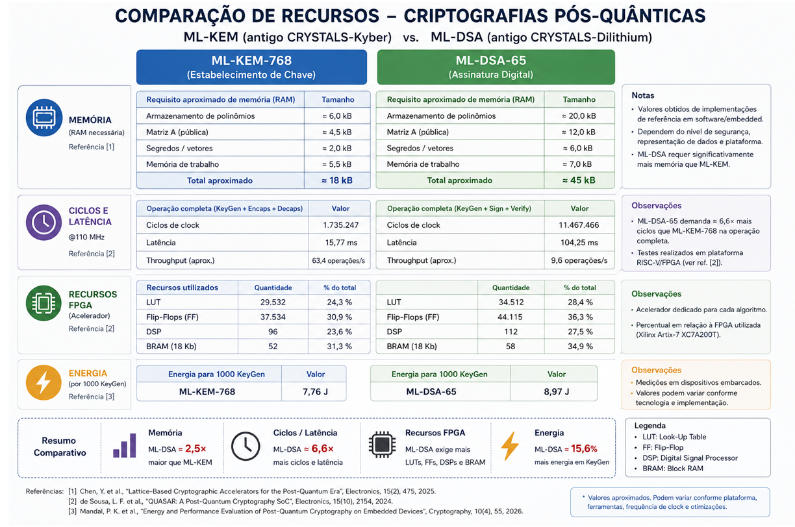
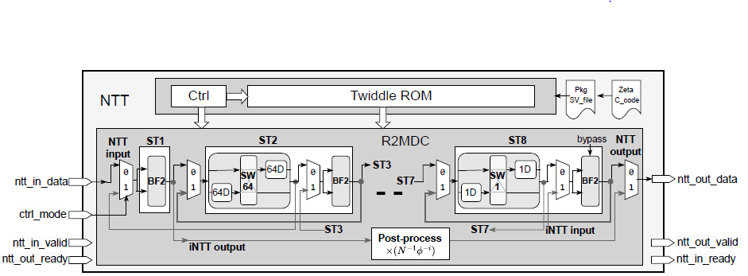
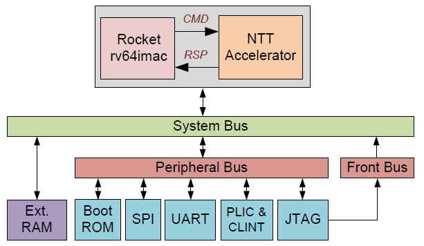
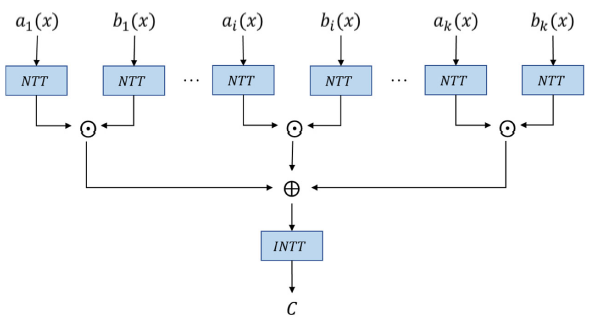
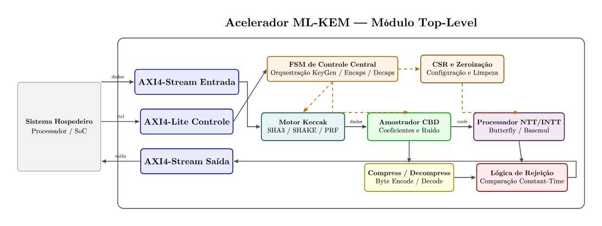

# 1. IDENTIFICAÇÃO

Este Plano de Trabalho descreve a proposta para o presente projeto de trabalho de conclusão de curso (TCC) que será executado pelos alunos da segunda turma do programa CI Digital no polo Inatel, conforme descritos na tabela de identificação a seguir:

| Título do Projeto       | *Acelerador para Criptografia Pós-Quântica ML-KEM (FIPS 203) Auditável com Interface AXI4:  Projeto RTL, Cobertura UVM com Vetores NIST e Síntese Lógica (AMD Zynq ZCU102 ou ZC702, ou Altera Cyclone V SOC Dev Kit)* |
| :---------------------- | :-------------------------------------------------------------------------------------------------------------------------------------------------------------------------------------------------------------------- |
| **Duração de Execução** | 6 meses                                                                                                                                                                                                               |
| **Mês de Início**       | Setembro de 2026                                                                                                                                                                                                      |
| **Mês de Fim**          | Fevereiro de 2027                                                                                                                                                                                                     |
| **Tópico Principal**    | Projeto de Circuitos Digitais                                                                                                                                                                                         |
| **Subáreas**            | Criptografia (ML-KEM); Funções Hash (RNG, Keccak)                                                                                                                                                                     |
| **Membros**             | Bruno Nassar Gouvêa Pereira; Guilherme Henrique Bernardes Paulino; Jonatan Arriel Reseck Neves; Luís Henrique Azevedo; Mateus Nassar Gouvêa Pereira.                                                      |
| **Colaboradores**       | André Francisco Ribeiro Bezerra; Bruno Bacelar Possato; Jean Wellington De Souza.                                                                                                                               |
| **Orientador**          | Dr. Elivander Judas Tadeu Pereira                                                                                                                                                                                     |

# 2. RELEVÂNCIA DO TEMA (CONTEXTUALIZAÇÃO)

O presente plano de trabalho propõe a implementação de um acelerador (hardware) para o algoritmo criptográfico pós-quântico (*PQC - Post-Quantum Cryptography*) **ML-KEM** (Module-Lattice- Based Key-Encapsulation Mechanism).

## 2.1. Pesquisa Sobre o Problema e Justificativas

Esta seção apresenta uma visão concisa sobre: os fundamentos da criptografia; os algoritmos mais comuns da atualidade; o atual cenário de *eventual* transição para computadores quânticos que justifica a adoção de novas tecnologias criptográficas (*PQC - Post-Quantum Cryptography*), como o ML-KEM; os fundamentos matemáticos por trás do ML-KEM; e, finalmente, a definição geral do algoritmo ML-KEM.

### 2.1.1. Criptografia e Função Hash Criptográfica

**Criptografia** é o conjunto de técnicas que transforma uma mensagem legível (plaintext) em um resultado protegido (ciphertext) usando um algoritmo e uma chave. A finalidade típica é confidencialidade; quando combinada com autenticação, também permite detectar alterações nos dados e confirmar a origem esperada. O princípio de projeto é que o algoritmo pode ser público: o segredo deve estar na chave \[**HAC-1996**\].

**Função hash criptográfica** mapeia uma entrada de tamanho arbitrário para um resumo (digest) de tamanho fixo. Ela deve tornar impraticável encontrar: uma entrada que produza um digest dado (pré-imagem), outra entrada com o mesmo digest (segunda pré-imagem), ou quaisquer duas entradas que colidam. É importante ressaltar que hash não é cifragem: trata-se de uma operação irreversível, sem chave de decifragem nem recuperação da entrada; suas principais finalidades são verificar integridade de dados, identificar dados, e gerar dados pseudoaleatoriamente (hash de um *seed*). SHA-2 e SHA-3 são famílias padronizadas pelo NIST \[**FIPS-180-4**\], \[**FIPS-202**\].

### 2.1.2. Criptografia Simétrica

**Conceito**: Na criptografia simétrica, remetente e destinatário usam a mesma chave secreta para cifrar e decifrar. É eficiente, mas cria o problema operacional de ter que distribuir tal chave sem expô-la \[**HAC-1996**\].

**Uso para cifrar dados**: Devido à sua eficiência, a criptografia simétrica é geralmente usada para proteger o volume de dados transmitidos: as partes definem uma chave secreta compartilhada e a usam para criptografar a mensagem. Geralmente, usa-se o mecanismo AES-GCM para tal (que utiliza cifras de bloco AES-128, AES-192 ou AES-256, operando sobre sobre dados fixos de 128 bits e usando chaves de 128, 192 ou 256 bits) \[**FIPS-197**\].

**AES e resistência quântica**: É consenso que o **Algoritmo de Shor** (algoritmo quântico) não quebra a criptografia AES (em tese, poderia aplicar busca de Grover para acelerar a busca exaustiva de chave, mas isso não significa uma quebra estrutural do algoritmo AES). Portanto, o NIST definiu os algoritmos AES-128/192/256 como referências de níveis de segurança para criptografias pós-quânticas (PQC) \[**Grover-1996**\], \[**FIPS-203**\].

### 2.1.3. Criptografia Assimétrica

**Conceito**: Neste modelo de criptografia, cada entidade possui uma chave pública, distribuível, e uma chave privada, que não pode sair do seu domínio (no exemplo mais básico, o remetente cifra o dado usando a chave pública do destinatário; o destinatário decifra o mesmo dado usando sua chave privada). O que uma parte faz com a chave pública não revela a contraparte privada sob a hipótese matemática do esquema. Isso resolve a distribuição inicial de segredo, mas ao preço de maior uso de recursos do que a criptografia simétrica \[**HAC-1996**\].

**Uso como KEM (Key-Encapsulation Mechanism)**: KEM é o mecanismo utilizado para proteger a chave simétrica compartilhada entre as partes (chave que cifra o volume de dados). Neste mecanismo, o remetente usa a chave pública do destinatário em Encaps, obtendo ciphertext da chave simétrica secreta; o destinatário utiliza sua chave privada em Decaps para extrair de ciphertext a mesma chave secreta. Em seguida, essa chave alimenta o AES ou outra cifra simétrica para obter os dados propriamente ditos. Portanto, KEM não é a cifra de alto volume (dados) \[**SP-800-227**\].

**RSA/ECC e o problema pós-quântico**: Os principais algoritmos assimétricos utilizados atualmente são o RSA (Rivest-Shamir-Adleman) e o ECC (Elliptic Curve Cryptography). RSA fundamenta-se na dificuldade de se fatorar inteiros $N$ grandes (ou seja, dado que $N = pq$, é computacionalmente difícil recuperar os números primos $p$ e $q$). Já o ECC fundamenta-se na dificuldade de logaritmo discreto em curvas elípticas. O problema de tais criptografias é que o **Algoritmo Quântico de Shor resolve fatoração e logaritmos discretos em tempo polinomial**, comprometendo suas premissas de segurança \[**Shor-1997**\], \[**FIPS-203**\]. E é justamente tal fato que **justifica o esforço em substituir tais criptografias: atualmente, não há algoritmo quântico conhecido equivalente capaz de resolver, por exemplo, o problema de Reticulado + Module-LWE utilizado pela criptografia PQC assimétrica ML-KEM** \[**FIPS-203**\] (algoritmo criptográfico que será o objeto proposto pelo presente plano de trabalho).

### 2.1.4. Fundamentos Matemáticos do ML-KEM

**Aritmética Modular**: é a matemática dos restos de divisão (por exemplo, $17\ mod\ 5=2$). Trata-se de uma **aritmética circular**: em módulo $q$, todo e qualquer número inteiro $X \geq 0$ terá um correspondente no conjunto circular $\{0,\ 1,\ ...,\ q-1\}$.
* Tal conjunto circular também é chamado de **anel quociente ${ℤ}_{q}{\ }$** (ou anel quociente de **$ℤ/qℤ$**).

Somar, subtrair e multiplicar usando apenas este conjunto circular mantém valores compactos e permite construir estruturas algébricas eficientes. No ML-KEM, **coeficientes polinomiais** são manipulados via **conjunto circular produzido por módulo $q=3329$** \[**FIPS-203, §4.1**\].

**Polinômios, Vetores e Matrizes**: Polinômio é qualquer expressão do tipo $(a_0+a_1X+a_2X^{2}+…)$. Exemplos de representações genéricas:
- Conjunto de polinômios (anel de polinômios) com coeficientes inteiros: $ℤ[X]$;
- Conjunto de polinômios (anel de polinômios) com coeficientes reais: $ℝ[X]$.

O ML-KEM trabalha no anel de polinômios ${R}_{q}\ =\ {ℤ}_{q}[X]/(X^{256}+1)$: resto da divisão entre ${ℤ}_{q}[X]$ e $(X^{256}+1)$. Ou seja, em termos práticos, o polinômio só poderá ter 256 coeficientes, todos módulo 3329, e a técnica de substituição aritmética $X^{256}=\ -1$ define como reduzir termos de grau a partir de 256 \[**FIPS-203, §4.1**\].

Em um ML-KEM implementado em hardware, um polinômio é representado através de um vetor de coeficientes $\{...,\ a2,\ a1,\ a0\}$. Portanto, um vetor de polinômios é uma matriz desses vetores de coeficientes; uma matriz de polinômios é uma matriz multidimensional desses vetores de coeficientes.

**Reticulados geométricos com valores inteiros**: Um **reticulado (lattice) com valores inteiros** é um conjunto discreto de pontos no espaço euclidiano formado por todas as **combinações lineares inteiras de um conjunto de vetores-base** linearmente independentes. Assim, cada ponto do reticulado é obtido multiplicando cada vetor-base por um coeficiente inteiro e somando os resultados. Geometricamente, isso produz uma estrutura periódica de pontos em uma ou mais dimensões. \[**Peikert-2016**\]

![Figura 1 - Exemplo de reticulado geométrico bidimensional \(2 vetores-base\) \[Shah-2019\]](resources/images/lattice-shah-2019.png)

Figura 1 - Exemplo de reticulado geométrico bidimensional (2 vetores-base) \[**Shah-2019**\]

### 2.1.5. Definição geral do algoritmo ML-KEM

O ML-KEM (*Module-Lattice-Based Key-Encapsulation Mechanism*) é um **algoritmo criptográfico assimétrico de encapsulamento de chaves (KEM)** padronizado pela norma **NIST FIPS 203**, publicada em 13 de agosto de 2024. Tal norma define ML-KEM-512, ML-KEM-768 e ML-KEM-1024, em ordem de maior força de segurança e menor desempenho \[**FIPS-203**\].

O algoritmo tem como premissa de segurança o problema de **Module-LWE (Learning With Errors) + Reticulado** \[**FIPS-203**\], \[**Peikert-2016**\]:
- No Module-LWE, tem-se a equação polinomial $b\ =\ As + e\ (mod\ q)$, conforme regras explicadas nos [fundamentos matemáticos do ML-KEM](#214-fundamentos-matemáticos-do-ml-kem), onde $b$ é o resultado cifrado (valor publicamente conhecido), $A$ é a chave pública do destinatário (valor publicamente conhecido), $s$ é a chave privada do destinatário (valor publicamente **desconhecido**) e $e$ é um pequeno erro aleatório (valor publicamente **desconhecido**; precisa ser pequeno para que o destinatário consiga recuperar o conteúdo contido em $b$).
- A partir da equação acima, onde $s$ e $e$ são desconhecidos, forma-se um reticulado de 256 dimensões/vetores-base (os coeficientes polinomiais), onde o problema (**premissa de segurança do algoritmo**) é encontrar o ponto exato dentro do reticulado (a chave privada $s$) capaz de recuperar o conteúdo contido em $b$. Atualmente, trata-se de uma tarefa que até mesmo algoritmos quânticos não seriam capazes de resolver em tempo polinomial.

## 2.2. Desafios Tecnológicos

Criptografias pós-quânticas, como o **ML-KEM** e o **ML-DSA**, apresentam requisitos computacionais significativos que envolvem **memória, ciclos de clock, latência, throughput e consumo energético**.

A análise desses requisitos permite avaliar os desafios associados às suas implementações em hardware.

De forma geral, o **ML-KEM** é utilizado para o estabelecimento de chaves, por meio das operações **KeyGen, Encaps e Decaps**, enquanto o **ML-DSA** é empregado em assinaturas digitais, envolvendo as operações **KeyGen, Sign e Verify**. Embora ambos sejam baseados em problemas matemáticos relacionados a reticulados, suas operações apresentam diferentes demandas de processamento e armazenamento.

Para essa análise, serão considerados resultados de implementações disponíveis na literatura, buscando identificar as principais características do **ML-KEM** e do **ML-DSA** em termos de desempenho e utilização de recursos. Esses resultados contribuem para a definição do escopo do projeto e para a identificação dos principais desafios envolvidos na implementação de aceleradores criptográficos em hardwares como FPGAs e ASICs.

A análise também permite identificar quais operações apresentam maior potencial para **aceleração por hardware** e quais componentes podem exercer maior impacto sobre os recursos da FPGA, como **LUTs, flip-flops, BRAMs e DSPs**.

**A Figura 2 apresenta um compilado dos principais requisitos computacionais do ML-KEM-768 e do ML-DSA-65, destacando diferenças em termos de ciclos de clock, latência e throughput.**

Figura 2 - Comparação ilustrativa dos requisitos computacionais de ML-KEM-768 e ML-DSA-65.

## 2.3. Trabalhos Existentes

Foram analisados trabalhos recentes relacionados à aceleração em hardware de algoritmos de criptografia pós-quântica, com foco no ML-KEM. A análise busca identificar as principais arquiteturas e técnicas utilizadas, como NTT, multiplicação polinomial, processamento paralelo e pipeline, além de comparar métricas como área, frequência, latência e throughput. Com isso, pretende-se compreender o estado da arte e identificar oportunidades para o desenvolvimento do acelerador proposto.

Na proposta apresentada pelos autores em \[**Tsai-2026**\], inicialmente são discutidos os avanços da computação quântica e como isto representa uma ameaça à infraestrutura de chave pública atualmente utilizada, citando como principal motivo o algoritmo de Shor que, em um computador quântico suficientemente poderoso, poderia resolver problemas matemáticos nos quais se baseiam sistemas criptográficos de chave pública atuais. O foco não está apenas em estudar ML-KEM, mas sim trazer uma proposta para solucionar o maior problema deste algoritmo - a multiplicação de polinômios. Segundo os autores, trata-se da operação mais fundamental nos esquemas baseados em reticulados e envolve convolução e aritmética modular, o que a torna uma uma das operações mais intensivas computacionalmente. No artigo os autores citam que uma implementação eficiente da NTT pode melhorar significativamente o desempenho desses algoritmos através de arquitetura interativa, onde várias unidades butterfly executam os estágios da NTT sequencialmente em vários estágios de pipeline. Porém, baseado em trabalhos anteriores, existem limitações para esta implementação: suporte limitado, hardware duplicado, processamento não contínuo e a complexidade do butterfly. Desta forma a contribuição se torna fazer uma única arquitetura NTT/iNTT, totalmente pipeline, utilizando a mesma configuração de butterfly utilizando Radix-2 MDC (Multi-path Delay Commutator) com 8 estágios, processamento de 2 coeficientes por ciclo, pipeline completo, uma única configuração de butterfly - capaz de suportar o ML-KEM e o ML-DSA.

Figura 3 - Arquitetura do Radix-2 Cooley-Tukey-only Butterfly (BF2)

Como resultado, eles implementaram a arquitetura em um AMD Zynq UltraScale+ MPSoC e o resultado foi de 3.821 LUTs, 2.970 FFs, 20 DSPs, 5 BRAMs e 322 MHz de frequência máxima; latência inicial de 130 ciclos; 58 μs para um vetor ML-KEM; 571 Mbps de throughput; Area-Time Product (ATP) de 13.679 para ML-KEM - que os autores apresentam como melhor que os trabalhos comparados.

Em \[**Dam-2026**\], os autores propõem um SoC baseado em RISC-V com um acelerador dedicado às operações NTT e INTT utilizadas na multiplicação polinomial do ML-KEM. Os autores identificam que, embora existam diversas implementações de aceleradores em FPGA, ainda são escassas implementações físicas em ASIC e que a comunicação entre CPU, memória e acelerador pode representar um gargalo. Para solucionar esse problema, o acelerador é fortemente acoplado ao processador RISC-V por meio da interface RoCC e de duas instruções customizadas.

Figura 4 - Arquitetura do SoC RISC-V proposto com acelerador NTT

A arquitetura utiliza duas Butterfly Units, FIFO e uma unidade de reordenação para executar NTT/INTT de forma eficiente. O sistema foi fabricado em tecnologia CMOS de 180 nm, atingindo 118 MHz, e apresentou speedup de até 14,51 vezes para NTT e 16,75 vezes para INTT, além de melhorias de até 56,5% no processamento completo do ML-KEM.

Di Matteo et al. \[**Tsai-2026**\] propuseram o CRYPHTOR, um acelerador de hardware em FPGA para os algoritmos pós-quânticos CRYSTALS-Kyber (ML-KEM) e CRYSTALS-Dilithium (ML-DSA), buscando reduzir o custo computacional e de memória das operações polinomiais por meio de NTT/INTT, unidades aritméticas dedicadas e uma arquitetura de memória unificada.

Figura 5 - Arquitetura de alto nível do acelerador CRYPHTOR

O acelerador utiliza interfaces AXI4 Slave e AXI4 Master com DMA, permitindo tanto o controle pelo processador quanto a transferência autônoma de dados. Implementado em uma FPGA Xilinx Zynq UltraScale+ e integrado a sistemas RISC-V, o CRYPHTOR apresentou ganhos de até 221,8× para INTT de Kyber e 300,2× para NTT de Dilithium em relação à execução em software. Como desafio, os autores destacam o aumento do consumo de recursos de hardware, especialmente DSPs, decorrente das operações de multiplicação e redução modular.

| Ref.               | Trabalho          | Principal contribuição                            | Limitação / oportunidade                                                                   |
| :----------------- | :---------------- | :------------------------------------------------ | :----------------------------------------------------------------------------------------- |
| \[**Kundi-2024**\] | NTT/iNTT pipeline | Alto throughput e arquitetura unificada           | Foco concentrado no datapath NTT, sem uma interface AXI4 apresentada como elemento central |
| \[**Dam-2026**\]   | RISC-V + NTT      | Integração hardware/software e implementação ASIC | Utiliza RoCC, específica ao ecossistema RISC-V                                             |
| \[**Tsai-2026**\]  | CRYPHTOR          | AXI4 \+ DMA \+ acelerador PQC                     | Maior flexibilidade implica maior utilização de recursos, especialmente DSPs               |

## 2.4. Referências Bibliográficas

   \[**FIPS-203**\]	NATIONAL INSTITUTE OF STANDARDS AND TECHNOLOGY. Module-Lattice-Based Key-Encapsulation Mechanism Standard. Federal Information Processing Standards Publication (FIPS PUB 203). Gaithersburg, MD: NIST, Aug. 2024. DOI: 10.6028/NIST.FIPS.203. Disponível em: [https://csrc.nist.gov/pubs/fips/203/final](https://csrc.nist.gov/pubs/fips/203/final). Acesso em: 19 ago. 2026.

   \[**HAC-1996**\]	MENEZES, A.; VAN OORSCHOT, P.; VANSTONE, S. Handbook of Applied Cryptography. Boca Raton: CRC Press, 1996. Fundamentos de criptografia simétrica, assimétrica e modos de uso. Disponível em: [https://cacr.uwaterloo.ca/hac/](https://cacr.uwaterloo.ca/hac/). Acesso em: 19 ago. 2026.

   \[**FIPS-180-4**\]	NATIONAL INSTITUTE OF STANDARDS AND TECHNOLOGY. Secure Hash Standard (SHS). Federal Information Processing Standards Publication (FIPS PUB 180-4). Gaithersburg, MD: NIST, Aug. 2015. Definição e uso de funções hash SHA-2. Disponível em: [https://doi.org/10.6028/NIST.FIPS.180-4](https://doi.org/10.6028/NIST.FIPS.180-4). Acesso em: 19 ago. 2026.

   \[**FIPS-202**\]	NATIONAL INSTITUTE OF STANDARDS AND TECHNOLOGY. SHA-3 Standard: Permutation-Based Hash and Extendable-Output Functions. Federal Information Processing Standards Publication (FIPS PUB 202). Gaithersburg, MD: NIST, Aug. 2015. Keccak, SHA-3 e SHAKE. Disponível em: [https://doi.org/10.6028/NIST.FIPS.202](https://doi.org/10.6028/NIST.FIPS.202). Acesso em: 19 ago. 2026.

   \[**FIPS-197**\]	NATIONAL INSTITUTE OF STANDARDS AND TECHNOLOGY. Advanced Encryption Standard (AES). Federal Information Processing Standards Publication (FIPS PUB 197-upd1). Gaithersburg, MD: NIST, May 2023. Especificação de AES-128/192/256. Disponível em: [https://doi.org/10.6028/NIST.FIPS.197-upd1](https://doi.org/10.6028/NIST.FIPS.197-upd1). Acesso em: 19 ago. 2026.

   \[**Grover-1996**\]	GROVER, L. K. A Fast Quantum Mechanical Algorithm for Database Search. In: ANNUAL ACM SYMPOSIUM ON THEORY OF COMPUTING (STOC), 28., 1996, Philadelphia. **Proceedings...** New York: ACM, 1996. p. 212–219. Busca quântica e aceleração quadrática idealizada. Disponível em: [https://doi.org/10.1145/237814.237866](https://doi.org/10.1145/237814.237866). Acesso em: 19 ago. 2026.

   \[**FIPS-204**\]	NATIONAL INSTITUTE OF STANDARDS AND TECHNOLOGY. Module-Lattice-Based Digital Signature Standard. Federal Information Processing Standards Publication (FIPS PUB 204). Gaithersburg, MD: NIST, Aug. 2024. Norma ML-KEM: parâmetros, funções internas, KeyGen, Encaps e Decaps. Disponível em: [https://nvlpubs.nist.gov/nistpubs/FIPS/NIST.FIPS.204.pdf](https://nvlpubs.nist.gov/nistpubs/FIPS/NIST.FIPS.204.pdf). Acesso em: 19 ago. 2026.

   \[**Shor-1997**\]	SHOR, P. W. Polynomial-Time Algorithms for Prime Factorization and Discrete Logarithms on a Quantum Computer. SIAM Journal on Computing, Philadelphia, v. 26, n. 5, p. 1484–1509, 1997. Algoritmo quântico contra fatoração e logaritmo discreto. Disponível em: [https://doi.org/10.1137/S0097539795293172](https://doi.org/10.1137/S0097539795293172). Acesso em: 19 ago. 2026.

   \[**SP-800-227**\]	NATIONAL INSTITUTE OF STANDARDS AND TECHNOLOGY. Recommendations for Key-Encapsulation Mechanisms. Special Publication (NIST SP) 800-227. Gaithersburg, MD: NIST, Sep. 2025. Recomendações de uso e considerações de implementação de KEMs. Disponível em: [https://doi.org/10.6028/NIST.SP.800-227](https://doi.org/10.6028/NIST.SP.800-227). Acesso em: 19 ago. 2026.

   \[**Kundi-2024**\]	KUNDI, D. et al. High-Performance NTT Hardware Accelerator to Support ML-KEM and ML-DSA. In: **ASHES '24: Proceedings of the 2024 ACM Workshop on Attacks and Solutions in Hardware Security**, New York: ACM, Nov. 2024. Disponível em: [https://doi.org/10.1145/3689644.3691238](https://www.google.com/search?q=https://doi.org/10.1145/3689644.3691238). Acesso em: 17 ago. 2026.

   \[**Dam-2026**\]	DAM, D.-T.; PHAM, C.-K. Accelerating Post-Quantum Cryptography: A High-Efficiency NTT for ML-KEM on RISC-V. **Electronics**, v. 15, n. 1, 100, 2026. Disponível em: [https://doi.org/10.3390/electronics15010100](https://doi.org/10.3390/electronics15010100). Acesso em: 17 ago. 2026.

   \[**Tsai-2026**\]	TSAI, Y.-C.; LIN, Y.-H.; HWANG, W.-J. An Open Hardware ML-KEM Polynomial Ring Accelerator on Chipyard RISC-V SoC: System-Level Integration and Evaluation. **Electronics**, v. 15, n. 12, 2511, 2026. Disponível em: [https://doi.org/10.3390/electronics15122511](https://doi.org/10.3390/electronics15122511). Acesso em: 17 ago. 2026.

   \[**Chen-2026**\]	CHEN, Y. et al. Lattice-Based Cryptographic Accelerators for the Post-Quantum Era. **Electronics**, v. 15, n. 2, 475, 2026. Disponível em: [https://doi.org/10.3390/electronics15020475](https://doi.org/10.3390/electronics15020475). Acesso em: 19 ago. 2026.

   \[**Sousa-2026**\]	DE SOUSA, J. E. et al. QUASAR: Achieving Quantum Readiness for Post-Quantum Cryptography on RISC-V at Minimum Hardware Cost. **Electronics**, v. 15, n. 10, 2154, 2026. Disponível em: [https://doi.org/10.3390/electronics15102154](https://doi.org/10.3390/electronics15102154). Acesso em: 19 ago. 2026.

   \[**Mandal-2026**\]	MANDAL, P. K. et al. Energy and Performance Evaluation of Post-Quantum Cryptography on Embedded Devices. **Cryptography**, v. 10, n. 4, 55, 2026. Disponível em: [https://doi.org/10.3390/cryptography10040055](https://www.google.com/search?q=https://doi.org/10.3390/cryptography10040055). Acesso em: 19 ago. 2026.

   \[**Peikert-2016**\]	PEIKERT, Chris. A decade of lattice cryptography. Foundations and Trends in Theoretical Computer Science, v. 10, n. 4, p. 283-424, 2016. DOI: 10.1561/0400000074. Disponível em: [https://web.eecs.umich.edu/\~cpeikert/pubs/lattice-survey.pdf](https://web.eecs.umich.edu/~cpeikert/pubs/lattice-survey.pdf). Acesso em: 31 ago. 2026.

   \[**Shah-2019**\]	SHAH, Jalil. Atomic and electronic structures of two-dimensional layers on noble metals. 2019. Tese (Doutorado em Física) - Linköping University, Linköping, 2019. DOI: 10.3384/diss.diva-160075. Disponível em: [http://www.diva-portal.org/smash/record.jsf?pid=diva2:1348325](http://www.diva-portal.org/smash/record.jsf?pid=diva2:1348325). Acesso em: 31 ago. 2026.

# 3. OBJETO PROPOSTO

## 3.1. Resumo

Conforme apresentado em [definição geral do algoritmo ML-KEM](#215-definição-geral-do-algoritmo-ml-kem), a criptografia de encapsulamento de chaves ML-KEM (*Module-Lattice-Based Key-Encapsulation Mechanism*) tem como premissa de segurança o problema de **Module-LWE + Reticulado**: dado um reticulado multidimensional feito a partir de vetores-base (os coeficientes polinomiais), encontrar um ponto específico (a chave privada) dentro de tal reticulado seria uma tarefa que até mesmo algoritmos quânticos não seriam capazes de resolver em tempo polinomial.

Porém, conforme demonstrado nas seções [2.2](#22-desafios-tecnológicos) e [2.3](#23-trabalhos-existentes), o algoritmo utiliza uma quantidade considerável de recursos, principalmente devido às operações aritméticas com polinômios.

Portanto, a proposta central do presente trabalho é elaborar um hardware que possa descarregar da CPU o processamento matemático do ML-KEM, gerando e encapsulando de forma matematicamente segura e dedicada a chave simétrica (por exemplo, uma chave AES) que será usada para criptografar o volume de dados a ser transmitido.

Tal acelerador criptográfico poderia ser utilizado por qualquer aplicação que envolva troca segura de chaves: HTTPS/TLS, VPNs, SSH, protocolos de mensageria segura, comunicação IoT, Infraestrutura de Chaves Públicas - PKI (integração com certificados digitais).

## 3.2. Objetivo Geral

O objetivo geral é criar um **Acelerador para Criptografia Pós-Quântica ML-KEM (FIPS 203) Auditável com Interface AXI4**: Projeto RTL, Cobertura UVM com Vetores NIST e Síntese Lógica *(AMD Zynq ZCU102 ou ZC702, ou Altera Cyclone V SOC Dev Kit)*.
- Nível de segurança parametrizável, com valor padrão ML-KEM-768;
- Auditável em 2 sentidos: no sentido de qualidade de código (módulos RTL que correspondem às seções da norma FIPS 203 + código UVM modular com scoreboard contendo os vetores de teste do NIST) e no sentido de conter registradores de telemetria/auditoria (CSRs).

O fluxo geral do acelerador pode ser dividido em três etapas \[**FIPS-203, §§6 - 7**\]:
- **Destinatário: KeyGen() → (pk, sk) :** gera matriz pública a partir de uma semente, amostra segredos/ruídos pequenos e produz a chave pública pk e a chave privada sk.
- **Remetente: Encaps(pk) → (ct, K) :** escolhe aleatoriedade, cria um ciphertext ct ligado a pk e deriva a chave compartilhada K.
- **Destinatário: Decaps(sk, ct) → K' :** usa sk para recuperar a mensagem interna, reencapsula deterministicamente e valida ct. Devolve a mesma K quando o ciphertext é válido.

## 3.3. Objetivos Específicos

### 3.3.1. Arquitetura

Em termos de arquitetura, o objetivo é ter um módulo top-level sincronizado por clock e reset assíncrono, expondo uma interface AXI4-Lite Subordinate destinada ao acesso aos CSRs de controle, status e telemetria, e duas interfaces AXI4-Stream: entrada/subordinate (seeds para *KeyGen*, chaves públicas para *Encaps* e *ciphertexts* a serem desencapsulados) e saída/manager (*ciphertexts* gerados no *Encaps* e o segredo compartilhado *K* resultante de *Encaps* ou *Decaps*). Internamente, uma FSM de Controle Central orquestra:
* **Processador NTT / INTT:**
	* **Função**: Responsável pelas transformações Number Theoretic Transform (NTT) e Inverse Number Theoretic Transform (INTT), além das operações aritméticas associadas à multiplicação de polinômios no domínio transformado \[**FIPS-203**\].
	* **Fluxo da NTT**: O processamento deverá contemplar a leitura dos coeficientes, aplicação das operações de butterfly utilizando os fatores ζ (zetas), multiplicações modulares, reduções e reorganização dos dados entre as diferentes etapas da transformação. Na implementação de referência, a NTT transforma o polinômio da representação normal para a representação no domínio NTT, enquanto a INTT realiza o caminho inverso; a multiplicação propriamente dita é realizada por basemul no domínio transformado \[**FIPS-203**\], \[**CRYSTALS-Kyber-REF**\]. A implementação em hardware analisada explicita esse fluxo por meio de múltiplas etapas ntt_layer, seguidas de redução modular, basemul_montgomery e acumulação dos resultados. A NTT é dividida em sete camadas de processamento, com operações de butterfly utilizando diferentes índices de zetas; os dados são divididos em dois fluxos, processados e posteriormente recombinados \[**PQC-Crystals-HLS-Accelerators**\].
	* **Fluxo da INTT**: Na direção inversa, a INTT utiliza sete camadas correspondentes, com inv_butterfly, recombinação dos fluxos e multiplicação final pelo fator necessário à transformação inversa \[**PQC-Crystals-HLS-Accelerators**\].
	* **Multiplicação de polinômios**: A transformação NTT não constitui, isoladamente, a operação de multiplicação de polinômios. Após a transformação dos polinômios para o domínio NTT, a multiplicação é realizada por meio de basemul, envolvendo as operações aritméticas necessárias entre os coeficientes transformados \[**FIPS-203**\], \[**CRYSTALS-Kyber-REF**\]. Nas operações envolvendo vetores ou matrizes de polinômios, os resultados das multiplicações individuais devem ser acumulados para produzir o polinômio resultante. Dessa forma, o processamento deverá contemplar também as operações de acumulação e redução dos resultados intermediários \[**CRYSTALS-Kyber-REF**\], \[**PQC-Crystals-HLS-Accelerators**\].
	* **Operações internas**: Portanto, o processador deverá ser entendido como um conjunto integrado de NTT/INTT + butterfly + multiplicação modular + redução + basemul + acumulação + controle do fluxo dos coeficientes, e não apenas como uma unidade matemática isolada. O datapath deverá controlar a movimentação dos coeficientes entre as diferentes camadas da transformação, a utilização dos fatores zetas, a separação e recombinação dos fluxos de dados e o encaminhamento dos resultados para as operações subsequentes \[**PQC-Crystals-HLS-Accelerators**\].
	* **Participação no ML-KEM**: No fluxo de KeyGen, a NTT é aplicada aos vetores secretos antes da multiplicação matriz-vetor. Em Encaps, é aplicada ao vetor aleatório utilizado na multiplicação com a matriz pública. Em Decaps, é aplicada ao ciphertext e ao vetor secreto antes da multiplicação necessária para recuperar a mensagem \[**FIPS-203**\], \[**CRYSTALS-Kyber-REF**\].
	* **Possibilidades de implementação**: As estruturas descritas, como butterfly, basemul, multiplicações e reduções modulares, correspondem a uma das formas possíveis de organizar o processamento. A implementação final poderá adotar uma arquitetura diferente para essas operações, desde que mantenha as transformações e operações matemáticas requeridas pelo ML-KEM.
* **Motor Keccak:**
	* **Função**: Responsável pela execução das primitivas de hash criptográfico SHA3-256, SHA3-512, SHAKE128 e SHAKE256, utilizadas em diferentes etapas do ML-KEM \[**FIPS-203**\].
	* **Permutação Keccak-f\[1600\]**: O componente deverá implementar a permutação Keccak-f\[1600\] e fornecer o mecanismo necessário para operações de hash, XOF e PRF. A implementação de hardware analisada utiliza um estado interno de 25 palavras de 64 bits e executa as rodadas da permutação por meio das operações correspondentes às etapas θ, ρ, π, χ e ι, incluindo rotações e aplicação das constantes de rodada \[**FIPS-202**\], \[**PQC-Crystals-HLS-Accelerators**\].
	* **Fluxo de processamento**: O fluxo de entrada deverá realizar a inicialização do estado, absorção dos bytes de entrada, aplicação do padding correspondente à função utilizada, execução da permutação e, quando aplicável, squeeze para produzir a quantidade de saída necessária. A operação deverá permitir que o estado interno seja atualizado sucessivamente enquanto os blocos de entrada são absorvidos e, nas operações de saída variável, que novas palavras sejam produzidas durante o squeeze, conforme quantidade de dados exigida na operação \[**PQC-Crystals-HLS-Accelerators**\], \[**FIPS-202**\].
	* **Utilização como XOF e PRF**: No ML-KEM, o SHAKE128 é utilizado como XOF na expansão da semente para geração da matriz pública, enquanto o SHAKE256 é utilizado como PRF para gerar os dados pseudoaleatórios posteriormente processados pelo CBD \[**FIPS-203**\]. A utilização do SHAKE como XOF permite produzir a quantidade necessária de bytes a partir de uma entrada inicial, enquanto a utilização como PRF permite produzir deterministicamente os dados necessários para a geração dos coeficientes de segredo e ruído \[**FIPS-203**\].
	* **Utilização das funções SHA3**: As primitivas SHA3-256 e SHA3-512 também são utilizadas em diferentes etapas do fluxo do ML-KEM para derivação e processamento de valores criptográficos \[**FIPS-203**\]. Dessa forma, o motor Keccak deverá ser compartilhado entre as diferentes operações, evitando a necessidade de implementar unidades independentes para cada função criptográfica.
	* **Organização do bloco**: A análise do fluxo em hardware mostra que o mesmo motor pode ser reutilizado para diferentes funções, onde a seleção do tamanho da taxa (rate), a quantidade de dados de entrada e a quantidade de dados produzidos são determinadas pela operação em execução \[**PQC-Crystals-HLS-Accelerators**\]. Dessa forma, o motor deverá disponibilizar ao restante do datapath um fluxo de bytes pseudoaleatórios ou valores derivados, sendo utilizado pelos blocos de geração da matriz, geração de ruído, derivação de valores e demais etapas que dependem das primitivas SHA-3 e SHAKE.
	* **Organização do processamento**: A organização apresentada para o motor Keccak é baseada no fluxo observado nas referências de hardware e serve como uma possibilidade de estruturação do bloco. A arquitetura definitiva poderá explorar outras formas de particionamento, paralelismo ou compartilhamento dos recursos, preservando as primitivas criptográficas necessárias.
* **Amostrador CBD (Centered Binomial Distribution):**
	* **Função**: Responsável pela conversão dos bytes pseudoaleatórios produzidos pelo PRF em coeficientes pertencentes à distribuição binomial centrada definida para o ML-KEM \[**FIPS-203**\], essenciais ao [erro estatístico do Module-LWE](#215-definição-geral-do-algoritmo-ml-kem).
	* **Geração dos dados de entrada**: O fluxo do componente começa com a recepção dos bytes produzidos pelo SHAKE256 e termina com a geração de um polinômio cujos coeficientes são pequenos e centrados em zero. Os dados recebidos pelo amostrador são produzidos deterministicamente a partir da semente e do nonce utilizados pela operação, permitindo que os mesmos valores sejam reproduzidos quando necessário durante o fluxo criptográfico \[**FIPS-203**\], \[**CRYSTALS-Kyber-REF**\].
	* **Processamento dos bits**: Na implementação de referência, para η=2, quatro bytes são carregados como um valor de 32 bits. Os bits são reorganizados por operações de máscara e deslocamento e, para cada grupo, são calculados dois valores a e b, sendo o coeficiente obtido por a-b \[**CRYSTALS-Kyber-REF**\]. Esse processamento transforma o fluxo de bits pseudoaleatórios em coeficientes pertencentes à distribuição definida para o parâmetro correspondente.
	* **Organização em hardware**: A mesma lógica é implementada em hardware pelas unidades cbd2 e cbd3, que recebem os fluxos produzidos pelo SHAKE e produzem diretamente os coeficientes dos polinômios \[**PQC-Crystals-HLS-Accelerators**\]. Assim, o bloco deverá conter, essencialmente, entrada de bytes, agrupamento de bits, extração dos grupos correspondentes, contagem dos bits e subtração, produzindo uma sequência de coeficientes pronta para o datapath NTT.
	* **Participação no ML-KEM**: Esse componente participa principalmente da geração dos vetores secretos e dos termos de erro. Em KeyGen, é utilizado para gerar os vetores de segredo e erro. Em Encaps, para gerar os vetores aleatórios e termos de erro utilizados na construção do ciphertext. Em Decaps, participa novamente quando o valor recuperado precisa ser reencapsulado para a verificação do ciphertext  \[**FIPS-203**\], \[**CRYSTALS-Kyber-REF**\], \[**PQC-Crystals-HLS-Accelerators**\].
	* **Estratégia de amostragem**: O procedimento descrito representa a estratégia observada nas implementações analisadas para transformar a saída pseudoaleatória em coeficientes da distribuição binomial centrada. Outras organizações internas podem ser empregadas para realizar essa mesma função, sem alterar a distribuição definida para os coeficientes pelo ML-KEM.
* **Datapath de Compress/Decompress e Byte(En/De)code:**
	* **Função**: Responsável pela transformação dos polinômios entre sua representação interna e os formatos definidos para chaves, ciphertexts e demais estruturas serializadas \[**FIPS-203**\].
	* **ByteEncode e ByteDecode**: A primeira função do datapath é realizar a conversão entre bytes e coeficientes, utilizada para reconstruir polinômios a partir de chaves ou ciphertexts e para serializar os resultados. O ByteEncode deverá organizar os coeficientes de acordo com a quantidade de bits definida para a representação correspondente e realizar o empacotamento desses valores em bytes. O ByteDecode deverá executar o processo inverso, extraindo os campos de bits dos bytes recebidos e reconstruindo os coeficientes \[**FIPS-203**\], \[**CRYSTALS-Kyber-REF**\].
	* **Compress**: A segunda função corresponde à compressão dos coeficientes. Na implementação de referência, a compressão realiza inicialmente o mapeamento dos coeficientes para representantes positivos, aplica a quantização definida pelo parâmetro $d$ e, posteriormente, empacota os valores resultantes em bytes \[**CRYSTALS-Kyber-REF**\]. A implementação de hardware reproduz esse fluxo por meio de operações de leitura dos coeficientes, normalização modular, quantização e empacotamento dos bits. Para diferentes parâmetros de compressão, são utilizados diferentes números de bits por coeficiente \[**PQC-Crystals-HLS-Accelerators**\].
	* **Decompress**: No caminho inverso, o decompress deverá extrair os campos de bits dos bytes recebidos e reconstruir os coeficientes utilizados pelo datapath aritmético. Esse processo deverá considerar a reconstrução dos valores a partir da representação comprimida e a aplicação das operações necessárias para produzir a representação utilizada pelas operações polinomiais subsequentes \[**FIPS-203**\].
	* **Empacotamento e organização dos dados**: Esse bloco também deverá controlar a ordem dos coeficientes e o agrupamento dos bits, pois a serialização não consiste simplesmente em copiar palavras de memória. A referência disponível na literatura mostra, por exemplo, a reconstrução de coeficientes de 12 bits a partir de grupos de três bytes e a organização posterior desses valores em streams internos \[**PQC-Crystals-HLS-Accelerators**\].
	* **Participação no ML-KEM**: O bloco será utilizado na preparação das chaves públicas e secretas e, principalmente, na codificação e decodificação dos ciphertexts durante Encaps e Decaps \[**FIPS-203**\], \[**CRYSTALS-Kyber-REF**\].
	* **Organização do datapath**: A sequência de quantização, empacotamento, desempacotamento e reconstrução apresentada é uma referência para a organização do datapath, podendo ser modificada conforme as decisões de projeto relacionadas a largura de dados, paralelismo, armazenamento e fluxo de dados. O requisito é que as representações produzidas e interpretadas sejam compatíveis com as especificações do ML-KEM.
* **Lógica de Rejeição Implícita:**
	* **Função**: Responsável pelo fluxo de verificação realizado durante o Decaps, evitando que o resultado da comparação do ciphertext seja exposto diretamente ao sistema como uma condição de erro \[**FIPS-203**\].
	* **Recuperação da mensagem**: O processamento começa pela decodificação do ciphertext recebido e pela recuperação da mensagem utilizando a chave secreta. A mensagem recuperada é então combinada com os valores armazenados na chave secreta para reconstruir os valores utilizados no encapsulamento \[F**IPS-203**\], \[**CRYSTALS-Kyber-REF**\].
	* **Reencapsulação**: A partir dos valores recuperados, o hardware executa novamente o fluxo de encapsulamento necessário para produzir um novo ciphertext. Esse fluxo envolve a geração dos coins, execução do CBD, NTT, multiplicação, INTT e compressão, produzindo o ciphertext que será comparado ao ciphertext original \[**PQC-Crystals-HLS-Accelerators**\].
	* **Comparação do ciphertext**: O ciphertext produzido durante a reencapsulação deverá ser comparado com o ciphertext originalmente recebido. A implementação de referência mostra explicitamente a sequência indcpa_dec → hash_g → indcpa_enc → verify, seguida do cálculo da chave de rejeição e da operação cmov para selecionar a chave final \[**CRYSTALS-Kyber-REF**\]. A comparação deverá considerar o ciphertext completo e produzir uma condição de igualdade ou falha sem interromper o fluxo criptográfico.
	* **Chave de rejeição**: Paralelamente à comparação, deverá ser calculada a chave de rejeição utilizando o segredo reservado para essa finalidade e o ciphertext recebido \[**FIPS-203**\]. Essa chave será utilizada como resultado alternativo quando a comparação indicar que o ciphertext recebido não corresponde ao ciphertext reconstruído.
	* **Seleção constant-time**: A chave normalmente derivada e a chave de rejeição deverão ser submetidas a uma seleção condicional em tempo constante. Quando a comparação for válida, deverá ser utilizada a chave normalmente derivada; quando houver divergência, deverá ser utilizada a chave de rejeição \[FIPS-203\], \[**CRYSTALS-Kyber-REF**\]. A seleção não deverá depender de uma ramificação de controle que produza comportamento temporal observável. Dessa forma, independentemente do resultado da comparação, o caminho de processamento deverá manter o comportamento necessário para impedir que a validade do ciphertext seja utilizada como um canal de informação \[**FIPS-203**\].
	* **Estratégia de verificação**: O fluxo de reencapsulação, comparação e seleção da chave apresentado constitui uma referência para a implementação do mecanismo de verificação do Decaps. A arquitetura final poderá organizar essas etapas de maneira distinta, desde que preserve o comportamento funcional e, principalmente, as propriedades de execução em tempo constante exigidas para evitar a exposição da validade do ciphertext.
* **Bloco de CSR e Zeroização de Chaves:**
	* **Função**: Responsável pela configuração, controle e observação do acelerador, além do gerenciamento do material criptográfico sensível.
	* **Interface de controle**: A interface de controle deverá permitir que o sistema hospedeiro selecione e inicie uma operação, forneça os endereços ou referências dos dados envolvidos, acompanhe o estado do processamento e identifique a conclusão da operação. Na implementação de referência disponível na literatura \[**PQC-Crystals-HLS-Accelerators**\], o núcleo possui uma interface AXI4-Lite Slave dedicada ao controle e interfaces AXI4 Master separadas para acesso à memória. Um wrapper separa os espaços de memória utilizados para ciphertext (gmemct), shared secret (gmemss), buffers (gmembuf), public key (gmempk) e secret key (gmemsk), permitindo que o núcleo movimente esses dados independentemente. A interface de controle possui os sinais de escrita e leitura AXI4-Lite (AW, W, B, AR e R) e sinalização de interrupção, sendo responsável por controlar o núcleo HLS.
	* **Registrador de controle**: Na arquitetura proposta, deverá existir um registrador de controle contendo o comando de início da operação e, quando aplicável, a seleção do modo KeyGen, Encaps ou Decaps. Esse registrador poderá também concentrar comandos relacionados à inicialização, reinicialização do processamento e acionamento da limpeza dos recursos internos.
	* **Registrador de status**: Deverá existir um registrador de status contendo as principais indicações do estado de execução do acelerador, incluindo, no mínimo, idle, busy, done e condição de erro. Essas informações permitirão ao sistema hospedeiro determinar se o acelerador está disponível, se uma operação está em andamento e quando os resultados podem ser consumidos.
	* **Registradores de configuração**: Deverão ser previstos registradores destinados aos parâmetros necessários à execução, quando esses parâmetros não forem fixos na implementação. Esses registradores deverão permitir configurar as informações necessárias para que a FSM de Controle Central possa executar corretamente a operação selecionada.
	* **Registradores de endereço e tamanho**: Quando os dados forem transferidos por memória, deverão ser previstos registradores de endereço e tamanho para indicar as regiões de memória ou buffers utilizados como entrada e saída. Na implementação de referência disponível na literatura \[**PQC-Crystals-HLS-Accelerators**\], os espaços de memória são separados entre ciphertext, shared secret, buffers, public key e secret key, permitindo que o núcleo movimente esses dados de forma independente.
	* **Registradores de interrupção**: Quando utilizada sinalização por interrupção, deverão ser previstos mecanismos para indicar a conclusão da operação ou uma condição de erro ao processador hospedeiro, evitando a necessidade de consulta contínua do registrador de status. A implementação final deverá definir os campos, offsets e largura exata desses registradores durante a especificação da interface AXI4-Lite.
	* **Zeroização de chaves**: A zeroização deverá abranger os recursos internos que possam conter material criptográfico sensível durante ou após a execução. Deverão ser considerados, principalmente:
		* Chave secreta;
		* Sementes utilizadas na geração de chaves;
		* Valores pseudoaleatórios;
		* Coins utilizados durante Encaps;
		* Coins utilizados durante a reencapsulação do Decaps;
		* Valores intermediários derivados desses dados;
		* Mensagem intermediária recuperada durante o Decaps;
		* Chave compartilhada intermediária;
		* Chave de rejeição;
		* Buffers temporários utilizados para armazenar esses valores;
		* Estados e buffers do motor Keccak que contenham dados derivados de material secreto;
		* Registradores e memórias dos blocos NTT/INTT, CBD e codificação quando armazenarem material sensível.
	* **Momento da zeroização**: A limpeza deverá ocorrer ao término da operação e poderá também ser acionada durante o reset ou mediante uma condição de erro definida pela arquitetura. O mecanismo deverá garantir que os dados não permaneçam acessíveis nos registradores, memórias ou buffers internos após a limpeza. A zeroização constitui um requisito de segurança da implementação e não uma operação matemática adicional do ML-KEM definida pela FIPS 203.
	* **Definição arquitetural**: A organização dos registradores, buffers, interfaces de controle e mecanismos de zeroização apresentada deve ser considerada uma proposta inicial para a integração do acelerador. A definição dos CSRs, seus campos, endereços, mecanismos de controle e estratégia de limpeza será consolidada durante o detalhamento da arquitetura, podendo diferir da organização observada nas implementações de referência.
* **Interfaces AXI4-Lite e AXI4-Stream**:
	* **Função**: Responsáveis pela comunicação entre o acelerador e o sistema hospedeiro, permitindo o controle e configuração do processamento e a transferência dos dados criptográficos de entrada e saída.
	* **AXI4-Lite**: A interface AXI4-Lite será utilizada para o acesso aos registradores de controle, status, configuração e demais CSRs do acelerador. Por meio dessa interface, o sistema hospedeiro poderá iniciar as operações, configurar os parâmetros necessários, acompanhar o estado de execução e identificar a conclusão ou ocorrência de erros. A interface deverá implementar os canais de escrita e leitura previstos no protocolo AXI4-Lite, incluindo os canais de endereço, dados e resposta \[**PQC-Crystals-HLS-Accelerators**\].
	* **AXI4-Stream de Entrada (Subordinate)**: A interface de entrada será utilizada para receber os dados necessários às operações do ML-KEM, permitindo o encaminhamento dos dados ao datapath interno sem exigir que cada componente conheça diretamente a origem dos dados. Conforme a operação executada, poderão ser recebidos seeds utilizados no KeyGen, chaves públicas utilizadas no Encaps e ciphertexts utilizados no Decaps.
	* **AXI4-Stream de Saída (Manager)**: A interface de saída será utilizada para encaminhar ao sistema hospedeiro os resultados produzidos pelo acelerador, incluindo ciphertexts gerados durante o Encaps e o segredo compartilhado K produzido durante o Encaps ou Decaps.
	* **Controle do fluxo**: As interfaces AXI4-Stream deverão permitir o controle do fluxo de dados por meio dos mecanismos de handshake definidos pelo protocolo, permitindo que o produtor e o consumidor coordenem a transferência dos dados. A arquitetura interna deverá ser capaz de interromper ou prosseguir com o processamento conforme a disponibilidade dos dados e a capacidade de recebimento do próximo estágio.
	* **Integração com a arquitetura**: As interfaces deverão atuar como camada de comunicação entre o ambiente externo e a FSM de Controle Central, que será responsável por interpretar os comandos recebidos pelos CSRs e encaminhar os dados para os componentes internos correspondentes. Dessa forma, os blocos NTT/INTT, Keccak, CBD, Compress/Decompress e demais componentes não deverão depender diretamente do protocolo externo de comunicação.
	* **Organização da implementação**: A utilização de módulos dedicados para AXI4-Lite e AXI4-Stream, ou a implementação das interfaces diretamente no módulo top-level, constitui uma decisão de organização do hardware. Para o presente projeto, tais interfaces serão encapsuladas em módulos dedicados (wrappers de integração), conforme as decisões de particionamento e integração do acelerador.

A FSM de Controle Central deverá, portanto, atuar como elemento responsável por sequenciar esses caminhos sem duplicar desnecessariamente os recursos. Um mesmo processador NTT/INTT poderá ser reutilizado nas três operações, assim como o motor Keccak poderá atender a geração da matriz, geração de ruído, hashing e derivação de chaves. A referência disponível na literatura \[**PQC-Crystals-HLS-Accelerators**\] demonstra tal organização em dataflow, com numerosos *hls::stream* conectando as etapas e permitindo que os dados sejam encaminhados entre NTT, redução, multiplicação, INTT, CBD, Keccak e codificação. No Decaps, por exemplo, o fluxo observado compreende a leitura do ciphertext e da chave secreta, descompressão e decodificação, NTT, basemul, acumulação, INTT, recuperação da mensagem, SHA3-512, geração de novos coins e repetição do fluxo de encapsulamento para posterior comparação.

O diagrama abaixo demonstra a visão geral de tal arquitetura:

Figura 6 - Diagrama da arquitetura

### 3.3.2. Diferenciais e Boas Práticas

São objetivos entregar os seguintes diferenciais e boas práticas de engenharia de hardware:
* **Rastreabilidade entre especificação FIPS 203, módulos RTL e testes**, permitindo identificar de qual parte do documento \[**FIPS-203**\] a funcionalidade implementada foi especificada, possibilitando conferir e verificar rapidamente se o módulo RTL e seu respectivo teste estão em conformidade com a especificação oficial.
* **CSRs específicos para status, contagem de ciclos, erros e auditoria:** os CSRs (*Control and Status Registers*) fornecem uma interface padronizada para controle e monitoramento do sistema, podendo ser utilizados para disponibilizar informações de status, contadores de desempenho e indicadores de erro do hardware. No presente projeto, pode-se destacar CSRs com as seguintes funções:
* **Controle e Status Geral:** registradores utilizados para controle de operações, sinalização de prontidão e para indicar a conclusão de processamento.
* **Contadores de Desempenho**: registradores utilizados para medir o tempo de execução de operações importantes como geração de chaves, encapsulamento e desencapsulamento, permitindo a análise da latência.
* **Registro de Erros e Exceções:** registradores utilizados para indicar e armazenar códigos referentes a falhas ocorridas durante a execução, como erros de acesso à memória, falhas internas ou *timeouts*.
* **Auditoria:** registradores utilizados para disponibilizar informações relevantes sobre a utilização e a identificação do hardware, como versão da implementação e contadores de operações e eventos de erro, possibilitando análises posteriores de diagnóstico e segurança.
* **Scoreboard + golden model para comparação automática dos resultados:** utilização de um modelo de referência (*golden model*) para gerar as saídas esperadas e de um *scoreboard* integrado no ambiente UVM, permitindo assim comparar os resultados gerados pelo RTL com os valores gerados pelo modelo de referência. Com essa abordagem é possível verificar de forma automatizada o funcionamento da implementação utilizando vetores de testes pré-definidos pelo NIST para o ML-KEM \[**NIST-VECTORS**\], possibilitando a identificação de divergências durante as verificações.
* **Avaliação de PPA após síntese:** a análise de PPA (*power, performance e area*) é realizada após a síntese do projeto para avaliar o consumo de recursos lógicos, o desempenho temporal e a estimativa de potência do hardware. Com essa validação é possível identificar gargalos de área e desempenho, além de permitir a comparação entre diferentes arquiteturas de implementação e otimização do RTL.

## 3.4. Referências Bibliográficas

 \[**FIPS-203**\]	NATIONAL INSTITUTE OF STANDARDS AND TECHNOLOGY. Module-Lattice-Based Key-Encapsulation Mechanism Standard. Federal Information Processing Standards Publication (FIPS PUB 203). Gaithersburg, MD: NIST, Aug. 2024. DOI: 10.6028/NIST.FIPS.203. Disponível em: [https://csrc.nist.gov/pubs/fips/203/final](https://csrc.nist.gov/pubs/fips/203/final). Acesso em: 25 ago. 2026.

 \[**FIPS-202**\]	NATIONAL INSTITUTE OF STANDARDS AND TECHNOLOGY. SHA-3 Standard: Permutation-Based Hash and Extendable-Output Functions. Federal Information Processing Standards Publication (FIPS PUB 202). Gaithersburg, MD: NIST, Aug. 2015. DOI: 10.6028/NIST.FIPS.202. Disponível em: [https://csrc.nist.gov/pubs/fips/202/final](https://csrc.nist.gov/pubs/fips/202/final).  Acesso em: 25 ago. 2026.

 \[**CRYSTALS-Kyber-REF**\]	AVANZI, Roberto et al. CRYSTALS-Kyber: Reference Implementation. GitHub repository. pq-crystals/kyber, ref. Disponível em: [https://github.com/pq-crystals/kyber/tree/main/ref](https://github.com/pq-crystals/kyber/tree/main/ref). Acesso em: 25 ago. 2026.

 \[**PQC-Crystals-HLS-Accelerators**\]	BSC-LOCA. PQC-Crystals-HLS-Accelerators: This technology implements a PQC accelerator for FPGA-based SoCs using HLS. GitHub repository. Disponível em:  [https://github.com/bsc-loca/PQC-Crystals-HLS-Accelerators](https://github.com/bsc-loca/PQC-Crystals-HLS-Accelerators). Acesso em: 25 ago. 2026.

 \[**NIST-VECTORS**\]	NATIONAL INSTITUTE OF STANDARDS AND TECHNOLOGY (NIST). Automated Cryptographic Validation Test System - Gen/Vals. GitHub repository. Disponível em: [https://github.com/usnistgov/ACVP-Server](https://github.com/usnistgov/ACVP-Server?utm_source). Acesso em: 26 ago. 2026.

# 4. RESPONSABILIDADES

Abaixo estão descritas as possíveis funções (responsabilidades) dentro do projeto e como elas serão divididas entre os membros da equipe:

| Função no projeto    | Descrição                                                                                                                                                                                                                                                                                                            |
| :------------------- | :------------------------------------------------------------------------------------------------------------------------------------------------------------------------------------------------------------------------------------------------------------------------------------------------------------------- |
| Responsável Geral    | Responsável por coordenar a divisão de tarefas na equipe; monitorar o cronograma de atividades; documentar as atividades desenvolvidas de cada membro; registrar contingências e executar planos de resolução; prestar contas ao professor.                                                                          |
| Líder Técnico        | Responsável por ter a visão geral de requisitos técnicos do projeto e dar assistência à equipe.                                                                                                                                                                                                                      |
| Designer RTL         | Responsável por desenvolver cada módulo de hardware do projeto (SystemVerilog). Requer conhecer as entradas e saídas de cada módulo trabalhado, bem como os pormenores de funcionamento de tais módulos.                                                                                                             |
| Verificador unitário | Responsável por desenvolver o testbench que testará cada módulo desenvolvido (SystemVerilog). Requer conhecer as entradas e saídas do módulo trabalhado, bem como seus casos de teste (operacionais e corner cases).                                                                                                 |
| Verificador UVM      | Responsável por desenvolver o testbench geral do projeto integrado (SystemVerilog + UVM). Requer conhecer o fluxo geral de funcionamento do projeto (entradas e saídas "de caixa preta"), bem como os casos de teste gerais do projeto (operacionais e corner cases) - precisa utilizar os vetores de teste do NIST. |
| Sintetizador         | Responsável por realizar a síntese de determinado módulo ou do projeto inteiro. Requer saber utilizar a ferramenta de síntese e ter noções sobre análise de PPA (Performance/timing, Power, Area).                                                                                                                   |
| Documentador         | Responsável por elaborar os documentos do projeto (artigo e slides de apresentação), bem como criar ou pesquisar eventuais ilustrações / fluxogramas / gráficos necessários.                                                                                                                                         |

| Membro                               | Funções Atribuídas                                                                                    |
| :----------------------------------- | :---------------------------------------------------------------------------------------------------- |
| Bruno Nassar Gouvêa Pereira          | Responsável geral; Líder técnico da equipe; **Designer RTL**; Sintetizador; Documentador. |
| Mateus Nassar Gouvêa Pereira         | **Designer RTL**; Sintetizador; Documentador.                                                   |
| Luís Henrique Azevedo                | **Verificador Unitário**; Sintetizador; Documentador.                                           |
| Guilherme Henrique Bernardes Paulino | **Verificador unitário**; Sintetizador; Documentador.                                           |
| Jonatan Arriel Reseck Neves          | **Verificador UVM**; Documentador.                                                                 |

# 5. METODOLOGIA DE TRABALHO

## 5.1. Plano de Atividades

### 5.1.1. Ao Longo de Todas as Fases

O Líder Técnico estuda os detalhes da norma oficial (FIPS 203) e tira as dúvidas da equipe quando necessário.

O Responsável Geral coordena a divisão de tarefas na equipe; monitora o cronograma de atividades; documenta as atividades desenvolvidas de cada membro; registra contingências e executar planos de resolução; presta contas semanalmente ao professor.

### 5.1.2. Fase 1 - Desenvolvimento Unitário

1. Para cada módulo de hardware, um Designer RTL e um Verificador Unitário atuarão de forma paralela e colaborativa, seguindo uma abordagem bottom-up na qual os módulos de menor nível são desenvolvidos e verificados antes da integração aos blocos superiores. O Designer RTL será responsável pela implementação do módulo em SystemVerilog, enquanto o Verificador Unitário desenvolverá o testbench (também em SystemVerilog) considerando a especificação funcional, interfaces, sinais de controle e condições de operação.

   A estratégia de verificação contemplará condições normais e casos de limite/*corner cases*. Os testes serão executados de forma incremental, acompanhando a evolução do RTL e comparando os resultados obtidos com os valores esperados ou vetores de referência definidos na especificação.

   Falhas identificadas durante a simulação serão analisadas conjuntamente, podendo resultar em ajustes no RTL, no testbench ou nos casos de teste. Após cada correção, os testes serão reexecutados para confirmar a solução e verificar a ausência de regressões.

   O código RTL e o testbench deverão conter comentários explanatórios em PT-BR, documentando as principais funcionalidades, decisões de implementação e estratégias de verificação.

2. Após a conclusão da implementação e da verificação unitária, será realizada a síntese do módulo por um dos integrantes da equipe. Os resultados serão posteriormente analisados em conjunto pelo Designer RTL e pelo Verificador Unitário.

   Serão avaliados os principais indicadores de implementação, como utilização de recursos, área, desempenho e violações de timing, relacionando-os aos resultados obtidos durante a verificação funcional.

3. Ao final da etapa, será elaborado um documento técnico conciso contendo a finalidade e o funcionamento do módulo, sua arquitetura, principais interfaces, estratégia de verificação e resultados obtidos.

   Quando pertinente, serão incluídos diagramas de blocos, fluxogramas, formas de onda, gráficos e resultados de síntese, permitindo relacionar a implementação RTL, a verificação e os resultados de hardware. Essa documentação será utilizada como material de apoio para a [fase 4](#615-fase-4-documentação-e-apresentação) do projeto.

4. Eventuais violações ou inconsistências serão tratadas conforme os [Planos de Contingência](#8-planos-de-contingências), com os devidos ajustes e revalidações sendo tomados até a obtenção de resultados satisfatórios dos trabalhos.

### 5.1.3. Fase 1 - Desenvolvimento UVM

1. O Verificador UVM será responsável pelo desenvolvimento do ambiente de verificação em UVM, que utilizará os vetores de teste de referência disponibilizados pelo NIST para validação das funcionalidades do ML-KEM.

   O desenvolvimento do ambiente UVM ocorrerá de forma incremental e orientada às micro funcionalidades UVM destinadas ao projeto (BFMs, Agents, Sequences \+ Tests, etc.). Não se trata da verificação UVM em si (aplicada ao DUT), apenas do desenvolvimento de código do ambiente. A cada micro-funcionalidade desenvolvida, o testbench é elaborado e executado (considerando um DUT fictício), com correções sendo feitas sob demanda.

   O testbench naturalmente deverá abordar condições normais de operação e casos de limite/ *corner cases*. Os resultados obtidos serão comparados com os resultados esperados (vetores de teste do NIST), permitindo avaliar a conformidade da implementação com a especificação.

   Quando forem identificadas divergências ou falhas durante a execução do ambiente, será realizada uma análise conjunta com o líder técnico para determinar sua origem. Conforme o caso, poderão ser necessárias correções no ambiente UVM, nos estímulos ou nos modelos de referência. Após cada correção, o ambiente será novamente elaborado e executado, garantindo a validação da alteração e evitando a introdução de novos erros.

   Esse processo será repetido ao longo do desenvolvimento, permitindo que o ambiente UVM evolua juntamente com o hardware.

2. Ao final do desenvolvimento do ambiente UVM, baseado nos comentários inseridos no código, o verificador UVM elaborará um documento técnico conciso demonstrando a arquitetura e o fluxo geral do testbench UVM (principais componentes, geração e aplicação dos estímulos, o monitoramento das interfaces, coleta e comparação dos resultados).

   Quando necessário, para facilitar a compreensão do ambiente desenvolvido, serão utilizadas ilustrações, diagramas de blocos, fluxogramas e/ou gráficos pertinentes.

   Essa documentação será utilizada posteriormente como material de apoio para a [fase 4](#615-fase-4-documentação-e-apresentação), juntamente com a documentação produzida durante o desenvolvimento e a verificação dos módulos RTL.

3. Eventuais violações ou inconsistências serão tratadas conforme os [Planos de Contingência](#8-planos-de-contingências), com os devidos ajustes e revalidações sendo tomados até a obtenção de resultados satisfatórios dos trabalhos.

### 5.1.4. Fase 2 - Integração e Verificação do ML-KEM

Os módulos RTL previamente desenvolvidos e verificados serão integrados em uma arquitetura única e submetidos à verificação funcional por meio do testbench UVM previamente desenvolvido.

Serão avaliadas as interações entre os módulos, interfaces e sinais de controle, considerando diferentes cenários de operação. Os resultados das simulações e respectivos *reports* serão analisados pela equipe, com correções nos módulos RTL ou nos ambientes de verificação unitários e UVM sendo aplicados quando necessário.

A fase será concluída após a validação do funcionamento integrado e a obtenção de resultados satisfatórios na verificação UVM.

Eventuais violações ou inconsistências serão tratadas conforme os [Planos de Contingência](#8-planos-de-contingências), com os devidos ajustes e revalidações sendo tomados até a obtenção de resultados satisfatórios dos trabalhos.

### 5.1.5. Fase 3 - Síntese e Análise do Hardware

Será realizada a síntese final da arquitetura integrada, com análise dos *reports* pela equipe, considerando os principais indicadores de implementação, como área, utilização de recursos, desempenho e timing.

Eventuais violações ou inconsistências serão tratadas conforme os [Planos de Contingência](#8-planos-de-contingências), com os devidos ajustes e revalidações sendo tomados até a obtenção de resultados satisfatórios dos trabalhos.

### 5.1.6. Fase 4 - Documentação e Apresentação

A documentação final será elaborada a partir dos documentos produzidos na [Fase 1](#611-fase-1-desenvolvimento-unitário), dos *reports* e resultados obtidos durante a integração ([Fase 2](#613-fase-2-integração-e-verificação-do-ml-kem)) e dos resultados da síntese final ([Fase 3](#614-fase-3-síntese-e-análise-do-hardware)).

Nessa etapa, serão consolidados os resultados do desenvolvimento, da verificação e da síntese, incluindo, quando pertinente, ilustrações, diagramas, fluxogramas, formas de onda e/ou gráficos, de modo a apresentar de forma clara e organizada a metodologia adotada e os principais resultados obtidos.

A elaboração dos materiais será distribuída entre os integrantes da equipe, quando possível alinhada às suas prévias responsabilidades no projeto: Mateus e Jonatan atuarão na elaboração do artigo; Luís Henrique e Guilherme serão responsáveis pela preparação dos slides da apresentação; Bruno Nassar fornecerá suporte às duas atividades, contribuindo para a revisão e consolidação dos materiais.

## 5.2. Repositório de Trabalho

Para o versionamento do código e dos documentos do projeto, será utilizado o seguinte repositório:
- https://github.com/cidigital-inatel/sd392-t25s2-group3.git](https://github.com/cidigital-inatel/sd392-t25s2-group3.git)

# 6. RESULTADOS ESPERADOS

## 6.1. Entregáveis e critérios de aceitação

Conforme explicado na [seção 5.1](#51-plano-de-atividades), a execução do projeto será dividida em quatro fases contemplando: a entrega progressiva dos módulos RTL e seus respectivos ambientes de verificação; a integração completa do ML-KEM; os artefatos de síntese; e, por fim, a documentação e apresentação dos resultados.

### 6.1.1. Fase 1 - Desenvolvimento Unitário

Nesta fase deverão ser implementados os módulos que compõem a arquitetura do acelerador ML-KEM, acompanhados de seus respectivos testbenches unitários. Cada módulo deverá possuir uma especificação básica de suas interfaces, funcionamento esperado, entradas e saídas, além dos critérios utilizados para sua validação.

| \#  | Entregável                                                          | Critério de aceitação                                                                                                                                                                                                                                                                                                                                |
| :-- | :------------------------------------------------------------------ | :--------------------------------------------------------------------------------------------------------------------------------------------------------------------------------------------------------------------------------------------------------------------------------------------------------------------------------------------------- |
| 1   | Processador NTT / INTT                                              | Executar corretamente as transformações NTT e INTT e as operações associadas à multiplicação de polinômios, apresentando resultados compatíveis com a referência utilizada para validação.                                                                                                                                                           |
| 2   | Motor Keccak                                                        | Executar corretamente as primitivas necessárias ao ML-KEM, incluindo SHA3-256, SHA3-512, SHAKE128 e SHAKE256, com resultados compatíveis com os valores esperados.                                                                                                                                                                                   |
| 3   | Amostrador CBD                                                      | Produzir corretamente os coeficientes da distribuição binomial centrada a partir dos dados pseudoaleatórios fornecidos ao módulo.                                                                                                                                                                                                                    |
| 4   | Compress/Decompress e Byte Encode/Decode                            | Realizar corretamente a codificação, decodificação, compressão e descompressão dos dados, preservando as representações definidas para as estruturas do ML-KEM.                                                                                                                                                                                      |
| 5   | Lógica de Rejeição                                                  | Executar corretamente o fluxo de verificação do Decaps, incluindo comparação do ciphertext e seleção da chave compartilhada correspondente, mantendo o comportamento constant-time requerido.                                                                                                                                                        |
| 6   | CSR e Zeroização                                                    | Permitir a configuração e o controle do acelerador por meio dos registradores definidos e garantir a limpeza dos dados sensíveis armazenados nos recursos internos previstos para zeroização.                                                                                                                                                        |
| 7   | Interfaces AXI4-Lite, AXI4-Stream Subordinate e AXI4-Stream Manager | Permitir comunicação correta entre o sistema hospedeiro e o acelerador, respeitando os protocolos das interfaces e realizando corretamente as transferências de controle, entrada e saída.                                                                                                                                                           |
| 8   | Módulo top-level                                                    | Módulo responsável pela integração do acelerador, contendo a FSM de Controle Central responsável pela orquestração dos fluxos de KeyGen, Encaps e Decaps e pela conexão com as interfaces AXI4-Lite e AXI4-Stream. Deverá permitir o controle da execução e o encaminhamento dos dados entre as interfaces e os componentes internos da arquitetura. |
| 9   | Testbenches unitários                                               | Cada módulo deverá possuir testbench capaz de exercitar suas principais funcionalidades, incluindo casos normais, casos de limite e condições de erro aplicáveis.                                                                                                                                                                                    |
| 10  | Documentação dos módulos                                            | Cada módulo deverá possuir documentação básica contendo função, interfaces, sinais, parâmetros, fluxo de dados e critérios utilizados para sua validação.                                                                                                                                                                                            |

### 6.1.2. Fase 1 - Desenvolvimento UVM

Ainda na Fase 1, deverá ser definida a estrutura do ambiente UVM que será utilizada na verificação integrada do acelerador (Fase 2).

| \#  | Entregável                              | Critério de conclusão                                                                                                                                                                                                                                                                                                                 |
| :-- | :-------------------------------------- | :------------------------------------------------------------------------------------------------------------------------------------------------------------------------------------------------------------------------------------------------------------------------------------------------------------------------------------ |
| 1   | Arquitetura Geral UVM                   | Esqueleto do testbench UVM definido e documentado, contemplando os componentes necessários para a verificação do DUT.                                                                                                                                                                                                                 |
| 2   | Scripts de Teste                        | Script automatizado e reprodutível dos testes.                                                                                                                                                                                                                                                                                        |
| 3   | BFMs (Bus Functional Models)            | Interfaces que definem os sinais do Design Under Test (acelerador ML-KEM), bem como as lógicas de manipulação de tais sinais (lógicas de protocolo). -> Um BFM para o AXI4-Lite; -> Um BFM para o AXI4-Stream Manager (conecta ao Subordinate do DUT); -> Um BFM para o AXI4-Stream Subordinate (conecta ao Manager do DUT). |
| 4   | Agents                                  | Drivers, Monitors, Sequencers implementados e capazes de realizar e observar as transações previstas. Um para cada BFM.                                                                                                                                                                                                               |
| 5   | Tests + Sequences                       | Implementação de testes (direcionado, smoke e/ou random), cobrindo os principais modos de operação e cenários funcionais (fluxos integrados de KeyGen, Encaps e Decaps, incluindo casos válidos, inválidos, casos de limite e cenários de erro aplicáveis)                                                                            |
| 6   | Coverage (parte funcional)              | Definição e coleta de cobertura funcional dos principais modos de operação, combinações de parâmetros e cenários relevantes.                                                                                                                                                                                                          |
| 7   | Coverage (parte de código)              | Coleta de cobertura de código, incluindo statement, branch, toggle e FSM, conforme aplicável ao projeto.                                                                                                                                                                                                                              |
| 8   | Scoreboard com Vetores de Teste do NIST | Comparação automática entre os resultados produzidos pelo DUT e os resultados esperados pela referência do NIST.                                                                                                                                                                                                                      |

### 6.1.3. Fase 2 - Integração e Verificação do ML-KEM

Os entregáveis desta fase serão o RTL integrado do acelerador ML-KEM, o testbench UVM final e os respectivos relatórios de verificação UVM.

O RTL integrado deverá conectar os módulos definidos na Fase 1 por meio da FSM de Controle Central e implementar os fluxos completos de KeyGen, Encaps e Decaps.

| \#  | Entregável          | Critério de aceitação                                                                                                                                                                                                                                                                                                                                                                                                                                                                                                                                                                                                                                                                                                                                                                                                                                                                                                                                              |
| :-- | :------------------ | :----------------------------------------------------------------------------------------------------------------------------------------------------------------------------------------------------------------------------------------------------------------------------------------------------------------------------------------------------------------------------------------------------------------------------------------------------------------------------------------------------------------------------------------------------------------------------------------------------------------------------------------------------------------------------------------------------------------------------------------------------------------------------------------------------------------------------------------------------------------------------------------------------------------------------------------------------------------- |
| 1   | RTL integrado       | Todos os módulos deverão estar integrados e conectados conforme a arquitetura definida, sem interfaces ou caminhos de dados não implementados.                                                                                                                                                                                                                                                                                                                                                                                                                                                                                                                                                                                                                                                                                                                                                                                                                     |
| 2   | Testbench UVM final | O ambiente deverá verificar os fluxos integrados de KeyGen, Encaps e Decaps, incluindo casos válidos, inválidos, casos de limite e cenários de erro aplicáveis.                                                                                                                                                                                                                                                                                                                                                                                                                                                                                                                                                                                                                                                                                                                                                                                                    |
| 3   | Reports UVM         | Deverão ser apresentados os resultados da regressão, cobertura funcional e cobertura de código, juntamente com o registro das falhas e sua resolução: -> **Fluxo Keygen**: A geração de chaves deverá ser executada de ponta a ponta e produzir resultados compatíveis com a referência utilizada. -> **Fluxo Encaps**: O encapsulamento deverá receber uma chave pública válida e produzir o ciphertext e o segredo compartilhado esperados. -> **Fluxo Decaps**: O desencapsulamento deverá recuperar o mesmo segredo compartilhado produzido pelo Encaps para ciphertexts válidos. Em caso de ciphertexts inválidos, o Decaps deverá executar corretamente o mecanismo de rejeição definido para ciphertexts inválidos, sem expor a condição de validade por meio do fluxo de seleção da chave. -> **Zeroização**: Os recursos internos definidos como contendo material sensível deverão ser limpos após as condições de zeroização especificadas. |

A aceitação desta fase ocorrerá quando os fluxos funcionais previstos forem validados pelo ambiente UVM e os critérios de cobertura e ausência de falhas definidos para o projeto forem atingidos.

### 6.1.4. Fase 3 - Síntese e Análise do Hardware

Após a validação funcional do RTL integrado, deverão ser produzidos os artefatos necessários à síntese e à avaliação das características físicas e de desempenho do acelerador.

| \#  | Entregável               | Critério de aceitação                                                                                                                                                                                                                                                                                                                                                                                                                                                                                                                                                |
| :-- | :----------------------- | :------------------------------------------------------------------------------------------------------------------------------------------------------------------------------------------------------------------------------------------------------------------------------------------------------------------------------------------------------------------------------------------------------------------------------------------------------------------------------------------------------------------------------------------------------------------- |
| 1   | Constraints              | Arquivos de restrições definidas para clock, I/O e demais requisitos necessários à síntese e análise temporal.                                                                                                                                                                                                                                                                                                                                                                                                                                                       |
| 2   | Configurações de síntese | Script de configurações utilizadas para reproduzir o processo de síntese de forma consistente (arquivos RTL, bibliotecas PDK, arquivos de constraints)                                                                                                                                                                                                                                                                                                                                                                                                               |
| 3   | Netlist                  | Netlist sintetizado correspondente ao RTL aprovado na Fase 2\.                                                                                                                                                                                                                                                                                                                                                                                                                                                                                                       |
| 4   | Relatórios de síntese    | Consolidação dos resultados de timing, área, potência e demais informações relevantes produzidas pelas ferramentas de síntese: -> **Timing**: Relatório contendo os resultados de análise temporal, incluindo frequência/clock alcançado, caminhos críticos e eventuais violações. -> **Area**: Relatório contendo os recursos de hardware utilizados pelo acelerador e sua distribuição entre os principais componentes. -> **Power**: Relatório de estimativa de consumo de potência obtido a partir das configurações e condições utilizadas na análise. |

A aceitação desta fase dependerá da conclusão da síntese sem erros impeditivos e da obtenção dos resultados de timing, área e potência dentro de margens aceitáveis para o projeto (usando os valores definidos nas seções [2.2](#22-desafios-tecnológicos) e [2.3](#23-trabalhos-existentes) como referências de comparação).

### 6.1.5. Fase 4 - Documentação e Apresentação

A última fase compreenderá a consolidação dos resultados obtidos durante o desenvolvimento e a preparação dos materiais para apresentação do projeto.

| \#  | Entregável             | Critério de aceitação                                                                                                                                                                                                                                                                                                                                                                                                                                                                                                                                                                                 |
| :-- | :--------------------- | :---------------------------------------------------------------------------------------------------------------------------------------------------------------------------------------------------------------------------------------------------------------------------------------------------------------------------------------------------------------------------------------------------------------------------------------------------------------------------------------------------------------------------------------------------------------------------------------------------- |
| 1   | Artigo final           | Documento contendo a motivação do projeto, fundamentação do ML-KEM, arquitetura proposta, descrição dos principais módulos, metodologia de verificação, resultados de simulação e síntese, análise dos resultados, conclusões e referências utilizadas. -> **Resultados experimentais**: Os resultados apresentados deverão ser consistentes com os relatórios de verificação e síntese produzidos nas fases anteriores. -> **Referências**: As fontes utilizadas no desenvolvimento e na fundamentação técnica deverão estar devidamente identificadas e relacionadas ao conteúdo apresentado. |
| 2   | Slides de apresentação | Apresentação contendo o problema abordado, objetivos, fundamentos necessários, arquitetura do acelerador, principais componentes, metodologia de verificação, resultados obtidos, limitações e conclusões.                                                                                                                                                                                                                                                                                                                                                                                            |

A aceitação final ocorrerá mediante a entrega do artigo e dos slides, contendo as informações necessárias para compreender a motivação, arquitetura, implementação, metodologia de verificação e resultados alcançados pelo projeto.

## 6.2. Ganhos esperados

Os ganhos esperados se referem principalmente à aceleração da execução do algoritmo ML-KEM por meio de sua implementação em hardware, buscando melhorar seu desempenho em relação à execução convencional em software. Espera-se com a implementação reduzir o tempo necessário para realização das operações criptográficas e aumentar a capacidade de processamento do algoritmo, mantendo suas funcionalidades de segurança e os mecanismos de auditoria e rastreabilidade previstos no projeto.

Com a implementação em FPGA, espera-se explorar o paralelismo das operações do ML-KEM com o objetivo de obter ganhos em métricas como latência, número de ciclos de clock e *throughput*. Além disso, espera-se que a arquitetura desenvolvida utilize de forma adequada os recursos disponíveis na FPGA, buscando estabelecer um equilíbrio entre desempenho e área utilizada.

Como referência para a definição dos ganhos, serão considerados os resultados de implementações de ML-KEM disponíveis na literatura, conforme apresentados nas seções [2.2](#22-desafios-tecnológicos) e [2.3](#23-trabalhos-existentes). Esses resultados servirão como base para estabelecer uma expectativa de desempenho e utilização de recursos para a solução desenvolvida, permitindo posteriormente avaliar quantitativamente os benefícios obtidos pela implementação proposta.

Além do ganho de desempenho, espera-se que o projeto resulte em uma arquitetura de acelerador criptográfico funcional e passível de integração em sistemas baseados em FPGA, preservando as operações previstas pelo ML-KEM e possibilitando sua avaliação quanto à eficiência de processamento e ao consumo de recursos.

# 7. CRONOGRAMA DE EXECUÇÃO

## 7.1 Cronograma com Detalhamento Descritivo de Atividades

| Fase | Meta | Descrição | Justificativa | Indicador Físico |  | Previsão de execução |  |
| :---: | :---: | ----- | ----- | ----- | ----- | :---: | :---: |
|  |  |  |  | **Unidade de medida** | **Quantidade** | **Início (Week)** | **Fim (Week)** |
| **Gestão do projeto (Responsável geral \+ Líder técnico)** | **M0.1** | Coordenar a divisão de tarefas na equipe; monitorar o cronograma de atividades; documentar as atividades desenvolvidas de cada membro; registrar contingências e executar planos de resolução; prestar contas ao professor. Estudar os detalhes da norma FIPS 203 e repassar detalhes aos membros. | Garantir o correto progresso dos trabalhos | \- Lista de atividades desenvolvidas; \- Cronograma de atividades; \- Lista de responsabilidades dos membros; \- Plano de contingências. | 1 de cada | **1** | **24** |
| **Fase 1: Desenvolvimento Unitário** | M1.1 | Processador NTT / INTT | Módulo fundamental, realiza as operações polinomiais | \- Módulo RTL; \- Testbench unitário; \- Documentação (RTL \+ Testbench). | 1 de cada | 1 | 5 |
|  | M1.2 | Motor Keccak | Executa primitivas de hash (randomizações), utilizadas em múltiplas etapas do acelerador | \- Módulo RTL; \- Testbench unitário; \- Documentação (RTL \+ Testbench). | 1 de cada | 1 | 5 |
|  | M1.3 | Amostrador CBD | Cria pequenos ruídos binomiais, a serem utilizados no Module-LWE. | \- Módulo RTL; \- Testbench unitário; \- Documentação (RTL \+ Testbench). | 1 de cada | 6 | 9 |
|  | M1.4 | Compress/Decompress e Byte Encode/Decode | Codificação, decodificação, compressão e descompressão dos dados, preservando as representações definidas para as estruturas do ML-KEM. | \- Módulo RTL; \- Testbench unitário; \- Documentação (RTL \+ Testbench). | \- Compressão: 1 RTL \+ 1 TB; \- Descompressão: 1 RTL \+ 1 TB; \- Encoding: 1 RTL \+ 1 TB; \- Decoding: 1 RTL \+ 1 TB. \- 1 documento geral. | 6 | 9 |
|  | M1.5 | Lógica de Rejeição | Fluxo de verificação do Decaps (verifica se a chave informada é capaz de recuperar o conteúdo cifrado) | \- Módulo RTL; \- Testbench unitário; \- Documentação (RTL \+ Testbench). | 1 de cada | 10 | 13 |
|  | **M1.6** | CSR e Zeroização | Configuração e o controle do acelerador por meio dos registradores definidos e garantir a limpeza dos dados sensíveis armazenados nos recursos internos | \- Módulo RTL; \- Testbench unitário; \- Documentação (RTL \+ Testbench). | 1 de cada | **10** | **13** |
|  | **M1.7** | Interfaces AXI4-Lite, AXI4-Stream Subordinate e AXI4-Stream Manager | Permitirá a correta comunicação entre o sistema hospedeiro e o acelerador | \- Módulo RTL; \- Testbench unitário; \- Documentação (RTL \+ Testbench). | \- AXI4-Lite (CSRs): 1 RTL \+ 1 TB; \- AXI4-Stream (Subord): 1 RTL \+ 1 TB; \- AXI4-Stream (Manag): 1 RTL \+ 1 TB. \- 1 documento geral. | **14** | **16** |
|  | **M1.8** | Módulo Top-Level | Fará integração do acelerador, contendo a FSM de Controle Central responsável pela orquestração dos fluxos de KeyGen, Encaps e Decaps e pela conexão com as interfaces AXI4-Lite e AXI4-Stream. Deverá permitir o controle da execução e o encaminhamento dos dados entre as interfaces e os componentes internos da arquitetura. | \- Módulo RTL; \- Testbench unitário; \- Documentação (RTL \+ Testbench). | 1 de cada | **14** | **16** |
| **Fase 1: Desenvolvimento UVM** | **M1.9** | Arquitetura Geral UVM | Esqueleto do testbench UVM definido e documentado, contempla os componentes necessários para a verificação do DUT. | \- Unidades de compilação (stubs .sv): para testbench, packages e BFMs; \- Header files (stubs .svh): para uvm\_objects e uvm\_components; \- Documento que conterá o fluxo geral do testbench. | Múltiplos arquivos | **1** | **1** |
|  | **M1.10** | Scripts de Teste | Script que permita a execução automatizada e reprodutível dos testes. | \- config.tcl \- run.tcl | 1 de cada | **1** | **1** |
|  | **M1.11** | BFMs (Bus Functional Models) | Interfaces que definem os sinais do Design Under Test (acelerador ML-KEM), bem como as lógicas de manipulação de tais sinais (lógicas de protocolo) | \- BFM para o AXI4-Lite; \- BFM para o AXI4-Stream Manager (conecta ao Subordinate do DUT); \- BFM para o AXI4-Stream Subordinate (conecta ao Manager do DUT); \- Explicações inclusas na documentação do testbench. | 1 de cada | **1** | **4** |
|  | **M1.12** | Agents | Drivers, Monitors, Sequencers implementados e capazes de realizar e observar as transações previstas. | \- Agente que se conecta ao BFM AXI4-Lite; \- Agente que se conecta ao BFM AXI4-Stream Manager; \- Agente que se conecta ao BFM AXI4-Stream Subordinate. \- Explicações inclusas na documentação do testbench. | 1 de cada | **5** | **6** |
|  | **M1.13** | Tests \+ Sequences | Implementação de testes (direcionado, smoke e/ou random), cobrindo os principais modos de operação e cenários funcionais (fluxos integrados de KeyGen, Encaps e Decaps, incluindo casos válidos, inválidos, casos de limite e cenários de erro aplicáveis) | \- Test \- Sequence; \- Explicações inclusas na documentação do testbench. | \- 1 ou mais Test \+ 1 ou mais Sequence (a depender da forma como as transações serão geradas); \- 1 documentação. | **7** | **9** |
|  | **M1.14** | Coverage (parte funcional) | Definição e coleta de cobertura funcional dos principais modos de operação, combinações de parâmetros e cenários relevantes. | \- Coverage; \- Explicações inclusas na documentação do testbench. | 1 de cada | **10** | **12** |
|  | **M1.15** | Coverage (parte de código) | Coleta de cobertura de código, incluindo statement, branch, toggle e FSM, conforme aplicável ao projeto. | \- Coverage; \- Explicações inclusas na documentação do testbench. | 1 de cada | **10** | **12** |
|  | **M1.16** | Scoreboard com Vetores de Teste do NIST | Comparação automática entre os resultados produzidos pelo DUT e os resultados esperados pela referência do NIST. | \- Scoreboard; \- Explicações inclusas na documentação do testbench. | 1 de cada | **13** | **16** |
| **Fase 2: Integração e Verificação UVM** | M2.1 | RTL integrado | Todos os módulos deverão estar integrados e conectados conforme a arquitetura definida, sem interfaces ou caminhos de dados não implementados. | Arquivos .sv integrados | Múltiplos arquivos | 17 | 19 |
|  | M2.2 | Testbench UVM final | O ambiente deverá verificar os fluxos integrados de KeyGen, Encaps e Decaps, incluindo casos válidos, inválidos, casos de limite e cenários de erro aplicáveis. | Arquivos .sv e .svh do ambiente UVM | Múltiplos arquivos | 17 | 19 |
|  | M2.3 | Reports UVM | Deverão ser apresentados os resultados da regressão, cobertura funcional e cobertura de código, juntamente com o registro das falhas e sua resolução (fluxo Keygen, Fluxo Encaps, Fluxo Decaps, Zeroização) | Arquivos txt | 1 arquivo monobloco ou múltiplos arquivos | 17 | 19 |
| **Fase 3: Síntese Final** | M3.1 | Constraints | Definem restrições para clock, I/O e demais requisitos necessários à síntese e análise temporal. | Arquivo sdc | 1 | 20 | 21 |
|  | M3.2 | Configurações de síntese | Script de configurações utilizadas para reproduzir o processo de síntese de forma consistente (arquivos RTL, bibliotecas PDK, arquivos de constraints) | Arquivo tcl | 1 ou mais, a depender | 20 | 21 |
|  | **M3.3** | Netlist | Principal produto da síntese (corresponde ao RTL aprovado na Fase 2\) | Netlist final | 1 | **20** | **21** |
|  | **M3.4** | Relatórios de síntese | Consolidação dos resultados de timing, área, potência e demais informações relevantes produzidas pelas ferramentas de síntese | Arquivos txt | 1 arquivo monobloco ou múltiplos arquivos (1 para timing, 1 para área, 1 para potência) | **20** | **21** |
| **Fase 4: Documentação Final** | **M4.1** | Artigo final | Documento contendo a motivação do projeto, fundamentação do ML-KEM, arquitetura proposta, descrição dos principais módulos, metodologia de verificação, resultados de simulação e síntese, análise dos resultados, conclusões e referências utilizadas | Documento LaTeX (Overleaf), convertido para PDF | 1 | **22** | **24** |
|  | **M4.2** | Slides de apresentação | Apresentação contendo o problema abordado, objetivos, fundamentos necessários, arquitetura do acelerador, principais componentes, metodologia de verificação, resultados obtidos, limitações e conclusões. | Slides (Google Slides, convertido para PDF) | 1 | **22** | **24** |

## 7.2. Visão Temporal do Cronograma de Execução

| Meta | Indicador físico |  | Semana |  |  |  |  |  |  |  |  |  |  |  |  |  |  |  |  |  |  |  |  |  |  |  |
| :---: | ----- | ----- | ----- | ----- | ----- | ----- | ----- | ----- | ----- | ----- | ----- | ----- | ----- | ----- | ----- | ----- | ----- | ----- | ----- | ----- | ----- | ----- | ----- | ----- | ----- | ----- |
|  | Unidade de medida | Quantidade | 1 | 2 | 3 | 4 | 5 | 6 | 7 | 8 | 9 | 10 | 11 | 12 | 13 | 14 | 15 | 16 | 17 | 18 | 19 | 20 | 21 | 22 | 23 | 24 |
| **M0.1** | \- Lista de atividades desenvolvidas; \- Cronograma de atividades; \- Lista de responsabilidades dos membros; \- Plano de contingências. | 1 de cada | x | x | x | x | x | x | x | x | x | x | x | x | x | x | x | x | x | x | x | x | x | x | x | x |
| **M1.1** | \- Módulo RTL; \- Testbench unitário; \- Documentação (RTL \+ Testbench). | 1 de cada |  |  |  |  | x |  |  |  |  |  |  |  |  |  |  |  |  |  |  |  |  |  |  |  |
| **M1.2** | \- Módulo RTL; \- Testbench unitário; \- Documentação (RTL \+ Testbench). | 1 de cada |  |  |  |  | x |  |  |  |  |  |  |  |  |  |  |  |  |  |  |  |  |  |  |  |
| **M1.3** | \- Módulo RTL; \- Testbench unitário; \- Documentação (RTL \+ Testbench). | 1 de cada |  |  |  |  |  |  |  |  | x |  |  |  |  |  |  |  |  |  |  |  |  |  |  |  |
| **M1.4** | \- Módulo RTL; \- Testbench unitário; \- Documentação (RTL \+ Testbench). | \- Compressão: 1 RTL \+ 1 TB; \- Descompressão: 1 RTL \+ 1 TB; \- Encoding: 1 RTL \+ 1 TB; \- Decoding: 1 RTL \+ 1 TB. \- 1 documento geral. |  |  |  |  |  |  |  |  | x |  |  |  |  |  |  |  |  |  |  |  |  |  |  |  |
| **M1.5** | \- Módulo RTL; \- Testbench unitário; \- Documentação (RTL \+ Testbench). | 1 de cada |  |  |  |  |  |  |  |  |  |  |  |  | x |  |  |  |  |  |  |  |  |  |  |  |
| **M1.6** | \- Módulo RTL; \- Testbench unitário; \- Documentação (RTL \+ Testbench). | 1 de cada |  |  |  |  |  |  |  |  |  |  |  |  | x |  |  |  |  |  |  |  |  |  |  |  |
| **M1.7** | \- Módulo RTL; \- Testbench unitário; \- Documentação (RTL \+ Testbench). | \- AXI4-Lite (CSRs): 1 RTL \+ 1 TB; \- AXI4-Stream (Subord): 1 RTL \+ 1 TB; \- AXI4-Stream (Manag): 1 RTL \+ 1 TB. \- 1 documento geral. |  |  |  |  |  |  |  |  |  |  |  |  |  |  |  | x |  |  |  |  |  |  |  |  |
| **M1.8** | \- Módulo RTL; \- Testbench unitário; \- Documentação (RTL \+ Testbench). | 1 de cada |  |  |  |  |  |  |  |  |  |  |  |  |  |  |  | x |  |  |  |  |  |  |  |  |
| **M1.9** | \- Unidades de compilação (stubs .sv): para testbench, packages e BFMs; \- Header files (stubs .svh): para uvm\_objects e uvm\_components; \- Documento que conterá o fluxo geral do testbench. | Múltiplos arquivos | x |  |  |  |  |  |  |  |  |  |  |  |  |  |  |  |  |  |  |  |  |  |  |  |
| **M1.10** | \- config.tcl \- run.tcl | 1 de cada | x |  |  |  |  |  |  |  |  |  |  |  |  |  |  |  |  |  |  |  |  |  |  |  |
| **M1.11** | \- BFM para o AXI4-Lite; \- BFM para o AXI4-Stream Manager (conecta ao Subordinate do DUT); \- BFM para o AXI4-Stream Subordinate (conecta ao Manager do DUT); \- Explicações inclusas na documentação do testbench. | 1 de cada |  |  |  | x |  |  |  |  |  |  |  |  |  |  |  |  |  |  |  |  |  |  |  |  |
| **M1.12** | \- Agente que se conecta ao BFM AXI4-Lite; \- Agente que se conecta ao BFM AXI4-Stream Manager; \- Agente que se conecta ao BFM AXI4-Stream Subordinate. \- Explicações inclusas na documentação do testbench. | 1 de cada |  |  |  |  |  | x |  |  |  |  |  |  |  |  |  |  |  |  |  |  |  |  |  |  |
| **M1.13** | \- Test \- Sequence; \- Explicações inclusas na documentação do testbench. | \- 1 ou mais Test \+ 1 ou mais Sequence (a depender da forma como as transações serão geradas); \- 1 documentação. |  |  |  |  |  |  |  |  | x |  |  |  |  |  |  |  |  |  |  |  |  |  |  |  |
| **M1.14** | \- Coverage; \- Explicações inclusas na documentação do testbench. | 1 de cada |  |  |  |  |  |  |  |  |  |  |  | x |  |  |  |  |  |  |  |  |  |  |  |  |
| **M1.15** | \- Coverage; \- Explicações inclusas na documentação do testbench. | 1 de cada |  |  |  |  |  |  |  |  |  |  |  | x |  |  |  |  |  |  |  |  |  |  |  |  |
| **M1.16** | \- Scoreboard; \- Explicações inclusas na documentação do testbench. | 1 de cada |  |  |  |  |  |  |  |  |  |  |  |  |  |  |  | x |  |  |  |  |  |  |  |  |
| **M2.1** | Arquivos .sv integrados | Múltiplos arquivos |  |  |  |  |  |  |  |  |  |  |  |  |  |  |  |  |  |  | x |  |  |  |  |  |
| **M2.2** | Arquivos .sv e .svh do ambiente UVM | Múltiplos arquivos |  |  |  |  |  |  |  |  |  |  |  |  |  |  |  |  |  |  | x |  |  |  |  |  |
| **M2.3** | Arquivos txt | 1 arquivo monobloco ou múltiplos arquivos |  |  |  |  |  |  |  |  |  |  |  |  |  |  |  |  |  |  | x |  |  |  |  |  |
| **M3.1** | Arquivo sdc | 1 |  |  |  |  |  |  |  |  |  |  |  |  |  |  |  |  |  |  |  |  | x |  |  |  |
| **M3.2** | Arquivo tcl | 1 ou mais, a depender |  |  |  |  |  |  |  |  |  |  |  |  |  |  |  |  |  |  |  |  | x |  |  |  |
| **M3.3** | Netlist final | 1 |  |  |  |  |  |  |  |  |  |  |  |  |  |  |  |  |  |  |  |  | x |  |  |  |
| **M3.4** | Arquivos txt | 1 arquivo monobloco ou múltiplos arquivos (1 para timing, 1 para área, 1 para potência) |  |  |  |  |  |  |  |  |  |  |  |  |  |  |  |  |  |  |  |  | x |  |  |  |
| **M4.1** | Documento LaTeX (Overleaf), convertido para PDF | 1 |  |  |  |  |  |  |  |  |  |  |  |  |  |  |  |  |  |  |  |  |  |  |  | x |
| **M4.2** | Slides (Google Slides, convertido para PDF) | 1 |  |  |  |  |  |  |  |  |  |  |  |  |  |  |  |  |  |  |  |  |  |  |  | x |

Nota: *Semanas preenchidas com tom de sombreamento em cor cinza indica o período de execução da meta, enquanto as células assinaladas com “x” indicam a semana de entrega de um indicador físico.*

# 8. PLANOS DE CONTINGÊNCIAS

## 8.1. Gerenciamento de Mudanças no Escopo

Sempre que houver quaisquer intercorrências (atraso de desenvolvimento, limitações técnicas, restrições de prazo, etc) que **afetem quaisquer objetivos definidos no [plano de atividades](#plano-de-atividades), nos [resultados esperados](#resultados-esperados) ou no [cronograma de execução](#cronograma-de-execução)**, tais intercorrências deverão ser devidamente registradas pelo Responsável Geral na **lista de contingências**, devendo conter**:
* Data;
* **Identificação da contingência/intercorrência**;
* **Ação a ser tomada**;
* Justificativa pela ação tomada;
* Observações, se aplicáveis (mudanças de prazos, entregáveis alterados, etc).

Abaixo estão algumas das possíveis ações que podem ser tomadas:
1. **Reestruturação do plano de atividades** (o que cada integrante fará);
2. **Reestruturação dos resultados esperados** (quais os entregáveis);
3. **Reestruturação do cronograma de execução** (execução antecipada ou paralela de atividades, replanejamento de prazos, inclusão ou exclusão de atividades, etc.);
4. Correções de RTL, testbench unitário ou ambiente UVM;
5. Alteração da estratégia de implementação de determinado módulo.

Sempre que houver tais intercorrências, o responsável geral deverá notificar o professor.

## 8.2. Mapeamento da Execução e Interdependências

Conforme descrito no [plano de atividades](https://docs.google.com/document/d/1j0pHjkP_AfRtE5LrEm-AKQ_FgCgBz5AqlkvHEiWSUN0/edit?pli=1&tab=t.0#heading=h.j3dn6r14co9d), nos [resultados esperados](#resultados-esperados) e no [cronograma de execução](#cronograma-de-execução), o projeto terá metas de entrega **sequenciais bottom-top** justamente para minimizar a interdependência de componentes e, por consequência, o risco de travamento dos trabalhos.

Abaixo está sintetizada a cadeia de execução com possíveis interdependências e contingências:

| Etapa | Atividade  | Interdependência | Contingências |
| :---: | :---: | :---: | :---: |
| Fase 1 (M1.1 a M1.8) | Design RTL \+ Verificação Unitária | A efetiva verificação unitária depende do módulo RTL pronto | Caso um integrante fique ocioso, será remanejado  para o Desenvolvimento UVM |
| Fase 1 (M1.9 a M1.16) | Desenvolvimento UVM | \- |  |
| Fase 2 (M2.1 a M2.3) | Integração | Fase 1 concluída  | Caso um integrante fique ocioso, será remanejado  para a fase 4\. |
| Fase 3 (M3.1 a M3.4) | Síntese final  | Fase 2 concluída | Caso um integrante fique ocioso, será remanejado  para a fase 4\. |
| Fase 4 (M4.1 a M4.2) | Documentação final | Para plenos trabalhos, precisa da Fase 3 concluída, mas pode ser adiantada em determinadas frentes | Motivação do projeto, fundamentação do ML-KEM, arquitetura proposta, descrição dos principais módulos e metodologia de verificação não dependem da conclusão da fase 2 ou da fase 3\. |

Conforme explicado na [seção 8.1](#gerenciamento-de-mudanças-no-escopo), qualquer intercorrência que ocorra nesta cadeia de execução deverá ser registrada na **lista de contingências** com as possíveis ações a serem tomadas.

## 8.3. Controle de Alterações no Cronograma

O [cronograma de execução](#cronograma-de-execução) será monitorado continuamente pelo **responsável geral** durante o todo o ciclo de desenvolvimento do hardware ML-KEM. Conforme explicado na [seção 8.1](https://docs.google.com/document/d/1j0pHjkP_AfRtE5LrEm-AKQ_FgCgBz5AqlkvHEiWSUN0/edit?pli=1&tab=t.0#heading=h.629g1q76grr), qualquer intercorrência que impacte o cronograma deverá ser devidamente registrada na **lista de contingências** com as possíveis ações a serem tomadas.

Eis algumas das potenciais intercorrências que poderiam exigir alterações no cronograma:

* Atraso na implementação de um módulo (devido a complexidade ou identificação de erros durante a verificação);
* Identificação de erros durante a verificação;
* Necessidade de alteração da arquitetura;
* Dificuldades de integração entre componentes;
* Resultados insatisfatórios de síntese;
* Dependências entre as etapas do projeto.

## 8.4. Mapeamento de Riscos e Plano de Ação

Abaixo estão listadas as principais **contingências** não citadas nas seções [8.2](#mapeamento-da-execução-e-interdependências) e [8.3](#controle-de-alterações-no-cronograma) que poderiam ocorrer no projeto, bem como possíveis **ações a serem tomadas**.

| Risco identificado | Impacto | Contramedidas |
| ----- | :---: | ----- |
| Desligamento de integrantes | Alto | Reduzir a dimensão de todo o escopo de projeto (reestruturar plano de atividades, resultados esperados e cronograma de execução). |
| Overhead do ambiente UVM | Alto | Simplificar o ambiente UVM (plano de atividades, resultados esperados e cronograma de execução). |
| Excesso de utilização dos recursos da FPGA | Alto | Dar atenção às sínteses unitárias (fase 1). Caso limites sejam excedidos, reavaliar a utilização de recursos, de paralelismo e otimizações arquiteturais. |
| Desempenho insuficiente | Alto | Monitorar frequência, latência e throughput durante as sínteses. Dar atenção especial às constraints SDC e às otimizações dos blocos críticos (operações de NTT/INTT e Motor Keccak). |
| Problemas relacionados às ferramentas de desenvolvimento e síntese | Média | Padronizar configurações, versões e scripts utilizados no projeto, mantendo os artefatos no repositório de trabalho. |
| Tempo insuficiente para documentação e apresentação | Média | Desenvolver a documentação de forma incremental durante o projeto, consolidando os resultados ao final. |
| Trabalhos adiantados | Baixo | Aumentar a dimensão do escopo de projeto (reestruturar plano de atividades, resultados esperados e cronograma de execução) \- implementar de fato o IP desenvolvido no FPGA. |

Os riscos classificados como de alto impacto deverão ser acompanhados com atenção durante todo o desenvolvimento.

E lembrando que as ações a serem tomadas definidas acima sempre deverão seguir os critérios descritos na [seção 8.1](https://docs.google.com/document/d/1j0pHjkP_AfRtE5LrEm-AKQ_FgCgBz5AqlkvHEiWSUN0/edit?pli=1&tab=t.0#heading=h.629g1q76grr).